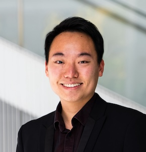

We are organizing the first edition of the Chilean Workshop on Multimodal Machine Learning in the Universidad Catolica del Norte in Coquimbo!  

Our keynote speakers will be Mohammad Soleymani and Paul Liang

### Invited Talk: Mohammad Soleymani

#### Multimodal Emotion Recognition

Mohammad Soleymani is a research associate professor with the USC Institute for Creative Technologies. He received his PhD in computer science from the University of Geneva in 2011. From 2012 to 2014, he was a Marie Curie fellow at Imperial College London. Prior to joining ICT, he was a research scientist at the Swiss Center for Affective Sciences, University of Geneva. His main line of research involves machine learning for emotion recognition and behavior understanding. He is a recipient of the Swiss National Science Foundation Ambizione grant and the EU Marie Curie fellowship. He has served on multiple conference organization committees and editorial roles, most notably as associate editor for the IEEE Transactions on Affective Computing (2015-2021), general chair for ICMI 2024 and ACII 2021 and technical program chair for ACM ICMI 2018 and ACII 2017. He was the president of the Association for the Advancement of Affective Computing (AAAC) (2019-2021).

### Invited Talk: Paul Liang

#### Fundamentals of Multimodal Representation Learning

Paul Liang is an Assistant Professor at the MIT Media Lab and MIT EECS. His research advances the foundations of multisensory artificial
intelligence to enhance the human experience. He is a recipient of the Siebel Scholars Award, Waibel Presidential Fellowship, Facebook
PhD Fellowship, Center for ML and Health Fellowship, Rising Stars in Data Science, and 3 best paper awards. Outside of research, he
received the Alan J. Perlis Graduate Student Teaching Award for developing new courses on multimodal machine learning.