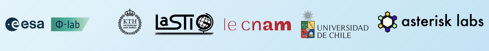

We are organizing the first edition of the the TerraBytes workshop, on large scale datasets and models for earth observation! 

Earth Observation (EO) presents unique challenges and opportunities that set it apart from other fields of machine learning (ML) and computer vision (CV) (Rolf et al., 2024). EO data is abundant, repeatedly covering a large but limited environment: our planet. The colocation and evolution of these observations is a rich, emergent source of information, of multimodal and multitemporal nature. However, due to both local and global changes, especially climate change, the statistical distribution of EO data is inherently non-stationary (Tarasiou et al., 2023). These properties break some of the usual assumptions of ML, and EO data require special care for data handling and modeling (Mai et al., 2022). In addition, current EO datasets are sampled with spatio-temporal biases. Some areas, e.g., the global South, are strongly under-represented within EO datasets (Cornebise et al., 2022). In optical imagery, cloud cover is undesirable, thus leading to datasets that remove cloudy images at the risk of biasing their geographical coverage (Tiede et al., 2021). Addressing these distributional biases is of primary importance, as they have an impact on the performance and reliability of models for downstream applications in ecology, geosciences, agriculture, urban planning, etc. (Kattenborn et al., 2022).

TerraBytes is an initiative to address these challenges. At the intersection of data curation, data archiving, and representation learning, this workshop will foster a holistic discussion covering major steps in the EO from downlinked satellite data, training paradigms to downstream applications.

### Invited Talks: TBA

More info in [our website](https://terrabytes-workshop.github.io/)! 

