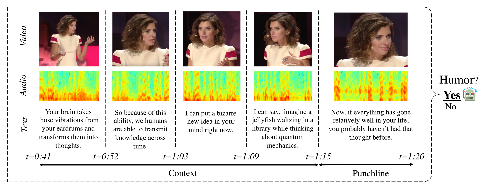

### Content

Humour is a key dimension in human-human communication and is used constantly, in a wide variety of contexts. It is used for its pleasing effect as it can help explain complex ideas during important presentations or it can serve as pure entertainment like in movies or stand up comedy. Sometimes, it can also be used in a less deliberate manner, unconsciously, as a way to regulate the inherent stress and tension arising in conversations, by presenting one’s ideas and intentions in an alternate way.

While Human-Agent interactions are growing in popularity due to the recent thrive of Large Language Models, the resulting conversations still remain frustrating for the users when they start to use subtle conversational strategies and skills such as irony, euphemism, hyperbolism and humour. 

Today, when a human is using humour during a human-agent interaction, this tends to interrupt the flow of the interaction. Agents interpret quite literally what a human is saying and as the agent does not react as the human would expect from a fellow conversational partner this leads to rephrasing, repeating and eventually frustration.  

Our vision for the future of conversational agents is that agents should be able at least to detect humorous attempts and to redirect the flow of the conversation accordingly. In this project, our main objective is to endow conversational agents with the ability to recognize when humour is being used by a human during human-agent interactions. Towards this goal, we will be relying on a multimodal approach and we will investigate how multimodal computational models can achieve this.

On this project, we will focus on the use of multimodal models with or without interactions [1,2] that can be also multilingual [3]. We would focus on multimodal but also multicultural specific social context [4], showing that multimodal is essential to detect complex human cultural and social phenonema such as sarcasm [5] or humour detection [6]. For group interactions, modelization of the speakers will be done using special architecture such as DialogueRNN [7].

### Tasks

Here, we will focus on the first brick of this amazing human-machine project, which is the characterization and detection of humor using verbal and non-verbal language. First, we will study this complex phenomena in various languages using stand-up comedy videos. Second, if time allows it, we would focus on dyad or group interactions, such as TV-shows or better, naturalistic interactions.     

The student will have to work on the several tasks:  
* Collection of a dataset of stand-up comedy videos on youtube
* Cleaning and analysis of the dataset  
* Multimodal modelization of human verbal and non-verbal language using binary classification
* Possibility to think about a more fine-grained humour taxonomy (more than just binary, how to propagate laugh, etc…)
* Collection of a dataset of humor in interactions 
* Modelization more complex of multi-party interactions

### Bibliography
    
[1] P. P. Liang, Y. Cheng, R. Salakhutdinov, and L. P. Morency, “Multimodal Fusion Interactions: A Study of Human and Automatic Quantification,” ACM Int. Conf. Proceeding Ser., pp. 425–435, 2023.

[2] A. Zadeh, P. P. Liang, N. Mazumder, S. Poria, E. Cambria, and L.-P. Morency, “Memory Fusion Network for Multi-view Sequential Learning,” in AAAI, 2018.

[3] A. Zadeh, Y. S. Cao, S. Hessner, P. P. Liang, S. Poria, and L. Morency, “CMU-MOSEAS : A Multimodal Language Dataset for Spanish , Portuguese , German and French,” in EMNLP, 2020, vol. 1, no. 1, pp. 1801–1812.

[4] M. Sap, S. Gabriel, L. Qin, D. Jurafsky, N. A. Smith, and Y. Choi, “Social Bias Frames: Reasoning about Social and Power Implications of Language,” Proc. ofthe 58th Annu. Meet. ofthe Assoc. Comput. Linguist., pp. 5477–5490, 2020.

[5] P. Desai, T. Chakraborty, and M. S. Akhtar, “Nice perfume. How long did you marinate in it? Multimodal Sarcasm Explanation,” in AAAI, 2022.

[6] M. K. Hasan et al., “UR-FUNNY: A Multimodal Language Dataset for Understanding Humor,” 2019.

[7] N. Majumder, S. Poria, D. Hazarika, R. Mihalcea, A. Gelbukh, and E. Cambria, “DialogueRNN: An Attentive RNN for Emotion Detection in Conversations,” in AAAI, 2019.