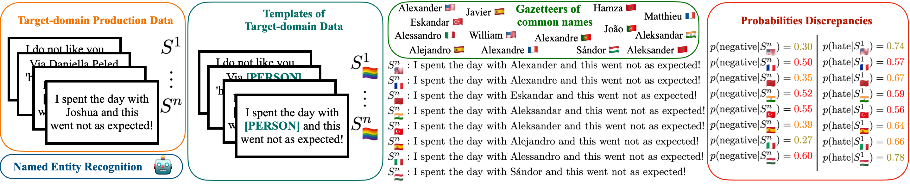

### Content

Classical bias detection methods used in Machine Learning are themselves biased because of the different confounding variables implied in the assessment of the initial biases. First they are using templates that are syntactically simple and distant from the target data on which the model will be applied. Second, current methods are assessing biases in pre-trained language models or in dataset, but not directly on the fine-tuned classifier that can actually produce harms. 
We propose a simple method to detect the biases of a specific fine-tuned classifier on any type of unlabeled data. The idea is to study the classifier behavior by creating counterfactual examples directly on the target data distribution and quantify the amount of changes. 

Our work offers a fine-grained analysis of the interactions between names and languages, revealing significant biases in multilingual models, but also strong biases towards some countries' names. We linked this with the pre-training data used to pre-train the LLM, by the mean of the Language Model's (pseudo-)likelihood and found out very socially interesting resuts. For example, a sentence containing a Moroccan name will be more likely to be tagged as positive, and less likely to be tagged as hate speech. 

In other words we want to answer the questions: (i) are LLM xenophobic? (ii) how to quantify it? (iii) how to remove this bias?

**Funds will be available to support the research of the student.** 

### Tasks

We started to answer these questions in two papers (one to be presented at COLING24 and one submitted at ACL24), and would like to continue the adventure with you! We plan to submit our future work at another international NLP/ML/AI conference.

We have several possibilities regarding the works that can be tackled in this tesis:
* LLM to generate data fitting to production data distribution (KL—>0)

* Generate more target-groups attributes (more fine-grained, since not relying on template; how to validate them)

* Method to reduce the bias of the trained model 

* Test current method on bigger LLM classifiers

* Our method is quantitative and require classes that can manually be seen as positives and negatives. How to extend this to any classification, how to check this bias qualitatively using an algorithm on the distribution (Optimal Transport distance or others…)

