## The slides are available [here](https://github.com/valbarriere/CC5205-Mineria-Datos-Content/raw/refs/heads/main/slides_es/DM_Modelos_SL.pdf)!

---

## K-Nearest Neighbors (K-NN)

### Overview

K-Nearest Neighbors (K-NN) is an instance-based learning algorithm that classifies a new point based on the majority label among its K closest training examples in the feature space. It does not build an explicit model.

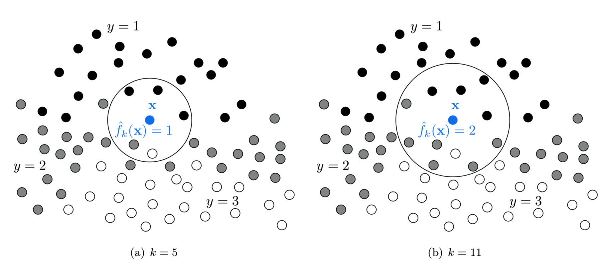

### Classification Rule

Given a point \( \mathbf{X} \), the K-NN classifier performs the following:

- Let \( S = \{(\mathbf{X}_i, y_i)\}_{i=1}^n \) be the training set
- Define a distance metric \( d(\cdot, \cdot) \)
- Sort the training points by distance to \( \mathbf{X} \)
- Take the first \( K \) elements: \( S^K_\mathbf{X} = \{\mathbf{X}_{\sigma(1)}, \dots, \mathbf{X}_{\sigma(K)}\} \)
- Count occurrences of each label in this subset

\[
h_{KNN}(\mathbf{X}) = \arg\max_y \frac{N^K_y(\mathbf{X})}{K}
\]

Where \( N^K_y(\mathbf{X}) \) is the number of neighbors with label \( y \).

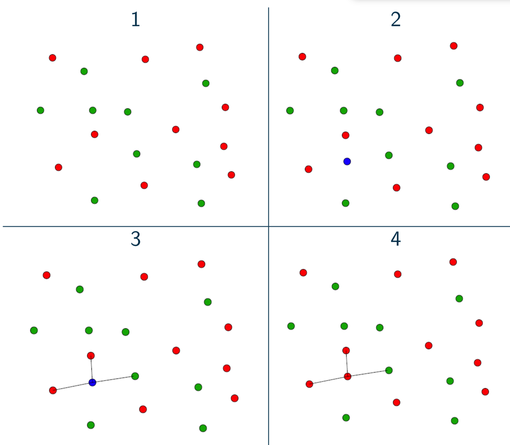

### Choosing K

The hyperparameter \( K \) controls the bias-variance tradeoff:

- **Small \( K \)** (e.g., 1 or 3): Low bias, high variance; very sensitive to noise.
- **Large \( K \)** (e.g., 20+): High bias, low variance; smooths out decision boundary.

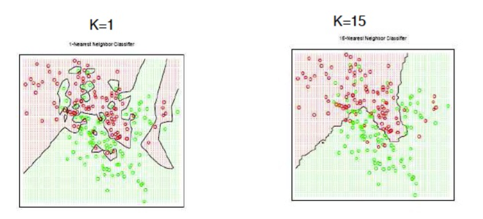

---

### Distance Metrics

The choice of distance metric can significantly affect K-NN performance. Common metrics include:

\[
d(x, y) = \left( \sum_i |x_i - y_i|^p \right)^{1/p}
\]

- **Manhattan distance**: \( p=1 \)
- **Euclidean distance**: \( p=2 \)
- **Chebyshev distance**: \( p = \infty \)
- **Mahalanobis distance**: Takes into account feature covariance:
  \[
  d(x, y) = \sqrt{(x - y)^T \Sigma^{-1} (x - y)}
  \]

**Important**: Normalize your features. Otherwise, features with large numeric ranges can dominate the distance computation.

More: [Scikit-learn distance metrics](https://scikit-learn.org/stable/modules/generated/sklearn.metrics.DistanceMetric.html)

---

### Feature Scaling and Normalization

Before using K-NN, apply proper preprocessing:

- **Standardization**: Gaussian distribution with zero mean and unit variance
  \[
  x' = \frac{x - \mu_x}{\sigma_x}
  \]

- **Min-Max Scaling**: Scale to \([0,1]\)
  \[
  x' = \frac{x - \min(x)}{\max(x) - \min(x)}
  \]

- **L2 Normalization**: Unit vector (used when orientation is more important than magnitude)

More on preprocessing: [scikit-learn documentation](https://scikit-learn.org/stable/modules/preprocessing.html)

---

### Strengths and Limitations

- **Advantages**:
  - Simple and intuitive
  - No training time (lazy learner)
  - Adapts to non-linear boundaries

- **Limitations**:
  - Computationally expensive at test time
  - Suffers from the **curse of dimensionality**: as dimensionality increases, all distances converge
  - Sensitive to irrelevant features

---

## Naive Bayes

### Bayes' Rule

Bayes' theorem relates the posterior probability of a class to its prior and likelihood:

\[
P(c|o) = \frac{P(o|c) \cdot P(c)}{P(o)}
\]

Where:

- \( P(c) \): prior probability of class \( c \)
- \( P(o|c) \): likelihood of observation given the class
- \( P(o) \): evidence (can be ignored for classification)
- \( P(c|o) \): posterior

### Naive Assumption

Naive Bayes assumes that features are **conditionally independent** given the class:

\[
P(o|c) = \prod_{i=1}^d P(x_i | c)
\]

Thus:

\[
\hat{c} = \arg\max_c P(c) \cdot \prod_{i=1}^d P(x_i | c)
\]

This assumption is rarely true in real-world data, but the algorithm often performs well despite it.

---

### Parameter Estimation

For categorical features:

\[
P(x_i = v | c) = \frac{\text{count}(x_i = v, c)}{\text{count}(c)}
\]

#### Laplace Smoothing

If a word/feature is not observed in class \( c \), then \( P(x_i | c) = 0 \), which will nullify the whole product. **Laplace smoothing** fixes this:

\[
P(x_i = v | c) = \frac{\text{count}(x_i = v, c) + \alpha}{\text{count}(c) + \alpha \cdot n}
\]

- \( \alpha \): smoothing parameter (usually 1)
- \( n \): number of possible values of \( x_i \)

---

### Continuous Features: Gaussian Naive Bayes

If features are continuous, assume they follow a Gaussian distribution per class:

\[
P(x_i | y) = \frac{1}{\sqrt{2\pi \sigma^2_y}} \exp\left( -\frac{(x_i - \mu_y)^2}{2\sigma^2_y} \right)
\]

Estimate \( \mu_y \) and \( \sigma_y \) from training data using MLE.

---

### Pros and Cons

- **Pros**:
  - Very fast to train
  - Robust to irrelevant features
  - Works well with high-dimensional, sparse data (e.g., text classification)

- **Cons**:
  - Strong independence assumption is rarely true
  - Poor probability estimates (outputs not well-calibrated)

---

## Decision Trees

### Overview

Decision Trees split the feature space using axis-aligned hyperplanes to partition data into regions that are homogeneous in class labels.

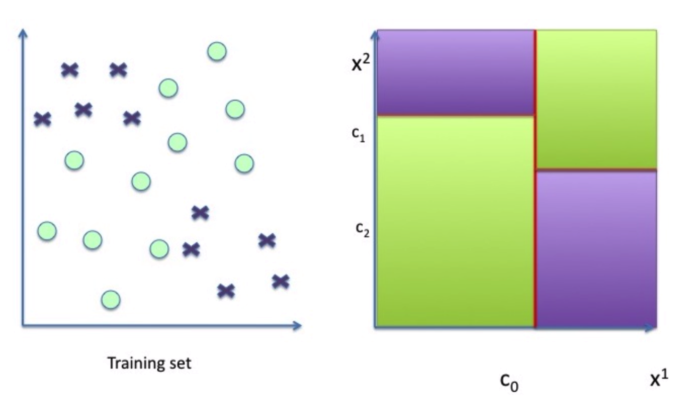

Each internal node splits on one feature. Each leaf represents a class.

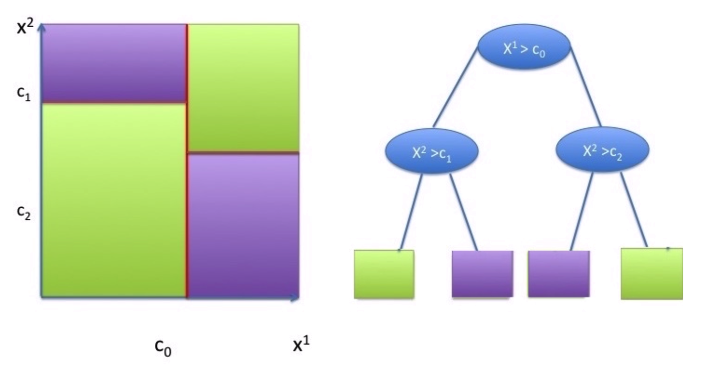

- Use axis-aligned splits \( x^j = \tau \)
- Represent decision process in a binary tree
- Each node corresponds to a split

\[
h_{tree}(\mathbf{X}) = \sum_{l=1}^{L} \alpha_l \mathbb{I}_{\mathcal{C}_l}(\mathbf{X})
\]

Where each \( \mathcal{C}_l \) is a region defined by a set of splits, and \( \alpha_l \) is the label for that region.

---

### Tree Construction

At each node, the tree:

1. Selects a feature \( x^j \) and a threshold \( \tau \)
2. Divides the data into:
   - Left: \( \{x \in \mathcal{S} \mid x^j \leq \tau\} \)
   - Right: \( \{x \in \mathcal{S} \mid x^j > \tau\} \)

It chooses the best split by minimizing the **impurity**.

---

### Impurity Measures

Given a subset \( \mathcal{S} \), define class proportions \( p_c \). Common criteria:

- **Entropy**:
  \[
  H(\mathcal{S}) = -\sum_c p_c \log p_c
  \]

- **Gini Index**:
  \[
  H(\mathcal{S}) = \sum_c p_c(1 - p_c)
  \]

- **Classification Error**:
  \[
  H(\mathcal{S}) = 1 - \max_c p_c
  \]

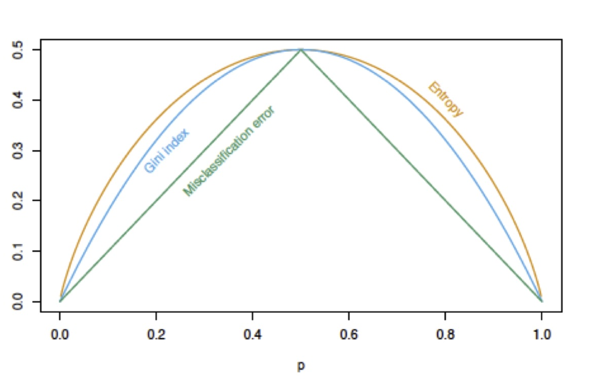

---

### Information Gain

Choose the feature \( j \) and threshold \( \tau \) that minimize:

\[
L(t_{j,\tau}, \mathcal{S}) = \frac{|\mathcal{D}|}{n} H(\mathcal{D}) + \frac{|\mathcal{I}|}{n} H(\mathcal{I})
\]

Where \( \mathcal{D} \) and \( \mathcal{I} \) are the left and right splits.

The **Information Gain** is the reduction in entropy from the split.

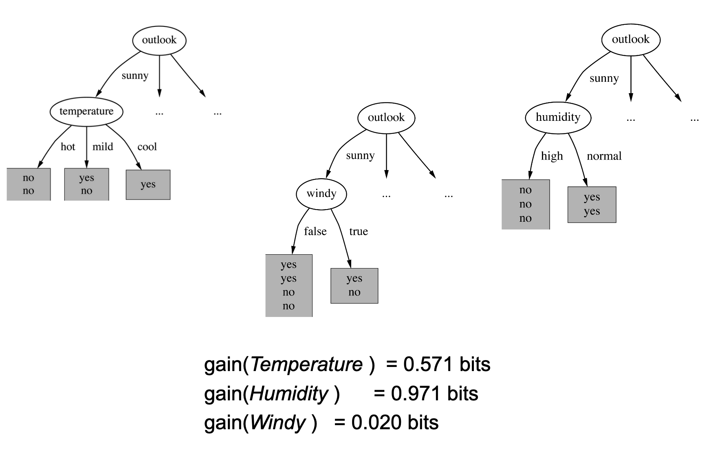

---

### Stopping Criteria

A tree stops growing when:

- Max depth is reached
- Leaf nodes have fewer than a minimum number of samples
- All samples in a node belong to the same class

Be cautious: allowing unrestricted growth leads to overfitting.

---

## Ensemble Methods 

### Bagging (Bootstrap Aggregation)

Bagging is an ensemble method where:

- Multiple models are trained on different bootstrap samples
- Their outputs are aggregated (majority vote or average)

\[
f_{ens}(\mathbf{X}) = \frac{1}{T} \sum_{t=1}^T f_t(\mathbf{X})
\]

Reduces **variance**, making the model more stable.

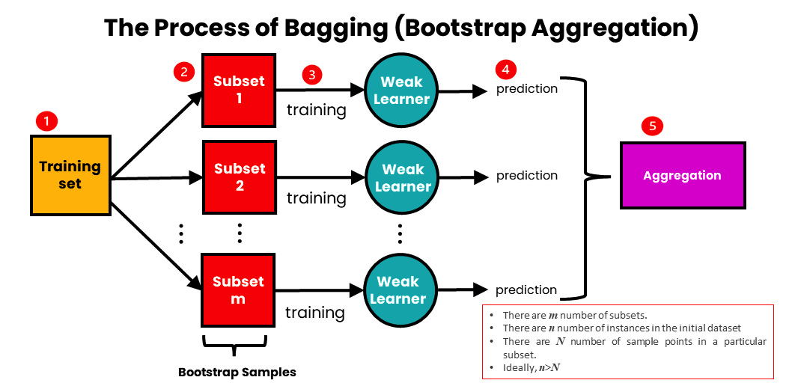

Equation for MSE:

\[
MSE(f_{ens}) = \frac{1}{T^2} \mathbb{E}\left[ \left( \sum_t \epsilon_t(x) \right)^2 \right]
\]

If \( \epsilon_t \) are uncorrelated, variance is reduced.

---

### Boosting

Boosting trains models sequentially, each correcting its predecessor’s mistakes:

1. Initialize equal weights on data
2. Train model \( h_t \)
3. Increase weights on **misclassified examples**
4. Aggregate predictions with weighted votes

Common boosting algorithms: AdaBoost, Gradient Boosting

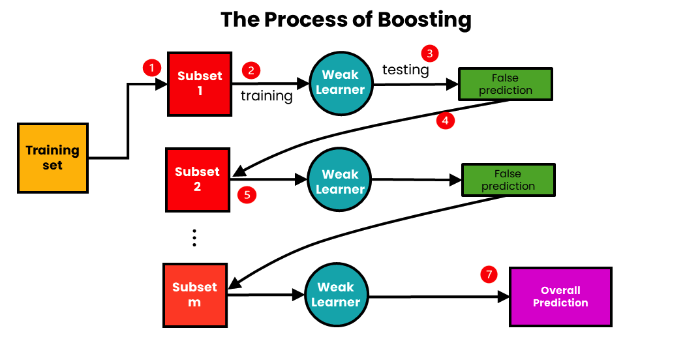

---

### Boosting Example

Binary classifiers are trained and added together:

\[
F_n(x) = \text{sign}(H_{n-1}(x) + h_n(x))
\]

Each learner focuses more on points misclassified by the previous.

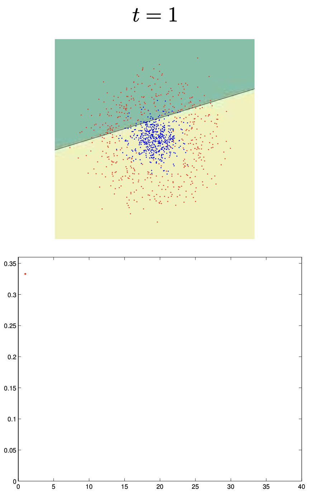

🔗 [More on Boosting](https://www.analyticsvidhya.com/blog/2023/01/ensemble-learning-methods-bagging-boosting-and-stacking/)  
🔗 [Adaboost from Jiri Matas class](https://www.robots.ox.ac.uk/~az/lectures/cv/adaboost_matas.pdf)

---

## Random Forest 

### Motivation

Decision trees are **high-variance** models. A small change in data can lead to very different trees.

**Random Forests** reduce variance by averaging multiple decision trees trained on different subsets of the data and features.

---

### Algorithm

1. For each tree \( t \in 1..T \):
   - Sample \( \mathcal{S}^{(t)} \) using bootstrap (sample with replacement)
   - Randomly choose \( k \ll F \) features at each node
   - Train a decision tree \( h^{(t)} \)
2. Output prediction:
   \[
   h^{(T)}(x) = \frac{1}{T} \sum_t h^{(t)}(x)
   \]

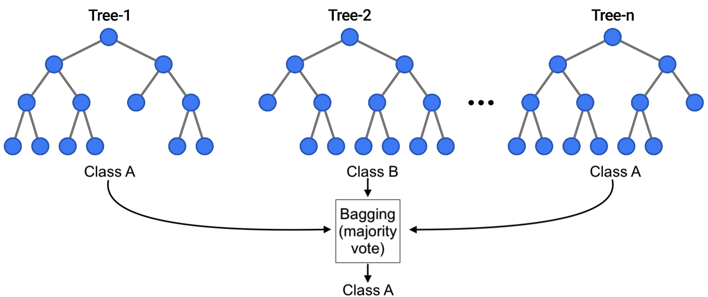

---

---

### Decision Boundaries

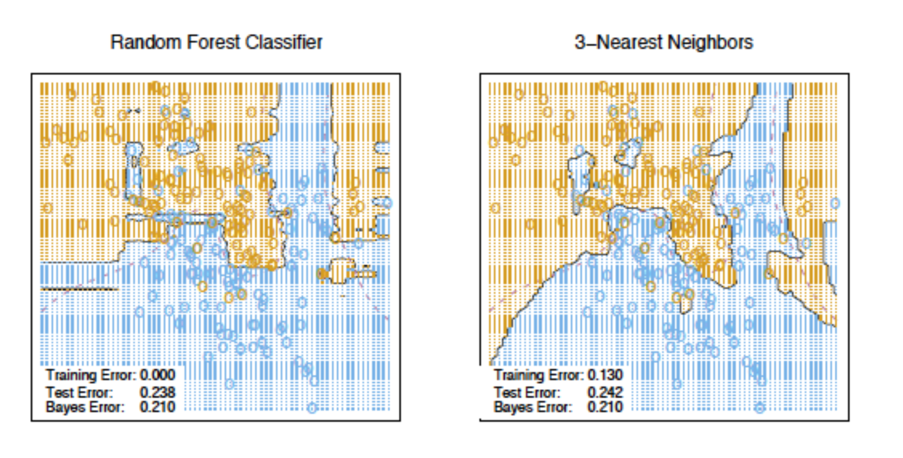

---

### Random Forest Regression

For regression tasks, replace impurity by variance reduction:

\[
L(t_{j, \tau}, \mathcal{S}) = VAR(\mathcal{S}) - \frac{|\mathcal{D}|}{n} VAR(\mathcal{D}) - \frac{|\mathcal{I}|}{n} VAR(\mathcal{I})
\]

Where:

\[
VAR(\mathcal{S}) = \frac{1}{|\mathcal{S}|} \sum_{(x^i, y^i) \in \mathcal{S}} (y^i - \bar{y})^2
\]

## Summary Tables

### Strengths and Weaknesses

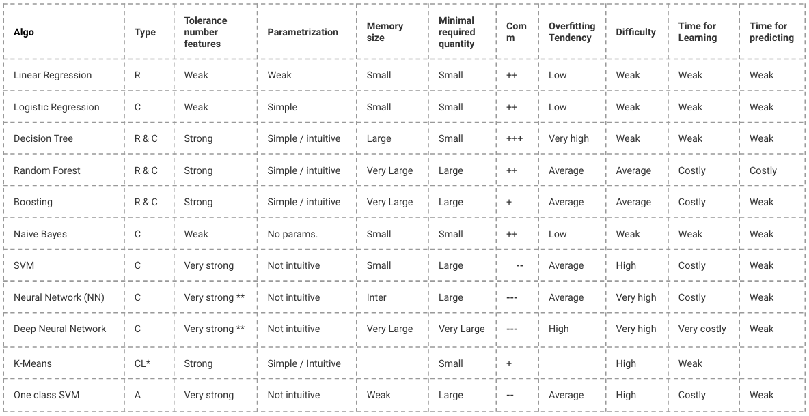

- K-NN: Easy to use, but slow and sensitive to irrelevant features
- Naive Bayes: Fast, works well with text
- Decision Trees: Interpretable, prone to overfitting
- Random Forests: Powerful and stable, but harder to interpret

🔗 [SAP ML algorithms summary](https://cai.tools.sap/blog/machine-learning-algorithms/2/)  
🔗 [Google Sheet: model comparison](https://docs.google.com/spreadsheets/d/1BETYWHJwA65TjrJ-mGwQ8lSpgk3V1cq3GOYRwbm1WDU/edit?usp=sharing)

---

### Model Selection Flow

You can refer to the scikit-learn decision flow:

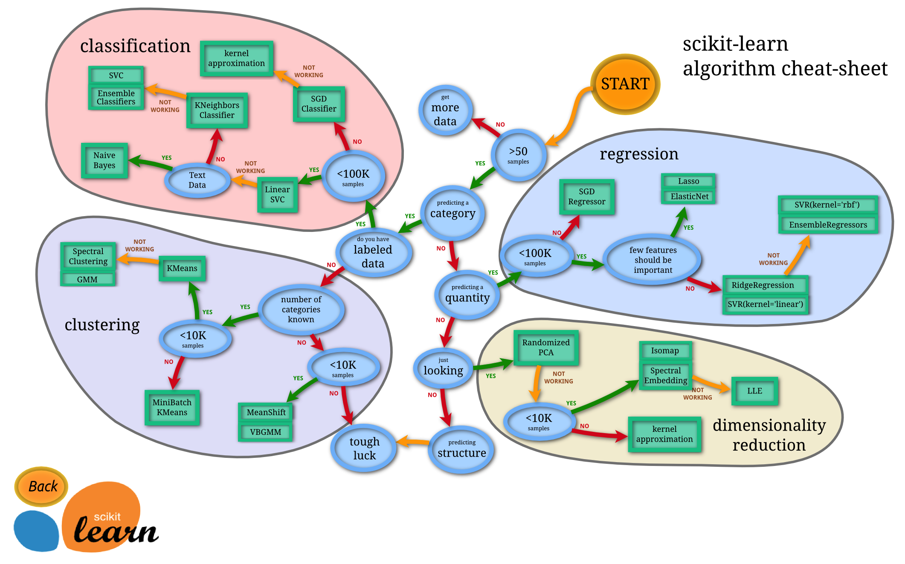

---

# See you in the classroom!

