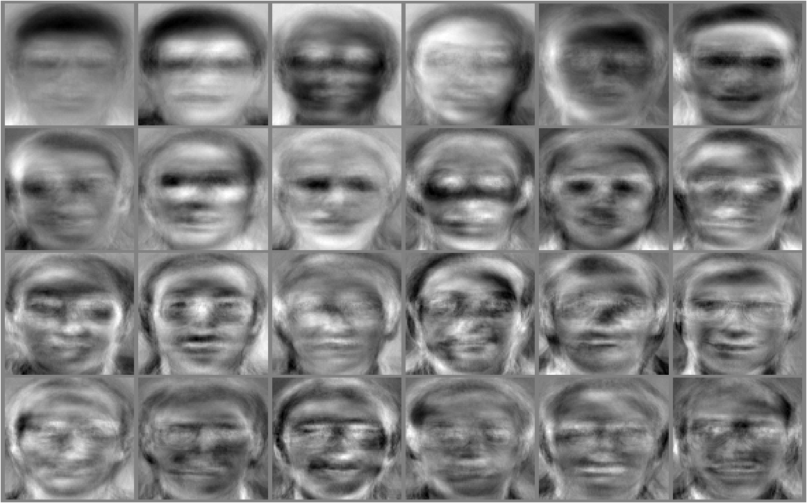

## The slides are available [here](https://github.com/valbarriere/CC5205-Mineria-Datos-Content/raw/refs/heads/main/slides_es/DM_Disminucion_Dimensiones.pdf)!

Las **técnicas de reducción de dimensión** buscan simplificar la representación de los datos, sea eliminando atributos innecesarios (selección de características) o encontrando una proyección más compacta que mantenga la mayor parte de la información. A continuación, veremos métodos tanto **supervisados** (wrappers, filters) como **no supervisados** (PCA, entre otros).

---

## Motivaciones para una Dimensión más Baja

### Selección y Reducción de Atributos

**Motivación General**  
- En muchos problemas de aprendizaje, hay **atributos irrelevantes** o **redundantes**.  
- Pueden perjudicar el desempeño de un clasificador o incrementar el costo de entrenamiento.  
- Dos enfoques principales:
  1. **Selección de atributos (supervisado)**: escoger un **subconjunto** relevante para la tarea (clasificación, regresión...).  
  2. **Reducción de dimensionalidad (no supervisado)**: encontrar una **proyección** de menor dimensión que concentre la información de los datos.

---

### Razones para Seleccionar Atributos

- **Árboles de decisión**:  
  - Aunque tratan de escoger atributos relevantes, si hay muchos atributos basura, puede aparecer sobreajuste (“aprender” ruido con árboles muy profundos).
- **KNN**:  
  - Se ve muy afectado por atributos irrelevantes, pues todas las dimensiones contribuyen igual al **cálculo de distancias**.
- **Naïve Bayes**:  
  - Robusto a atributos irrelevantes (los ignora en la probabilidad a posteriori), pero sufre con atributos muy **correlacionados** (redundantes).

> En general, se quiere **mitigar la curse of dimensionality** (maldición de la dimensionalidad).

---

## Selección de Atributos

### Filtros vs. Envoltura

**Feature-based (Filtros)**  
- Evalúan atributos por **propiedades de los datos** (p.ej. varianza, correlación, información mutua).  
- Independientes del clasificador.  
- Más rápidos y con menos riesgo de sobreajuste, pero **no captan** interacciones complejas con la tarea predictiva.

**Model-based (Wrappers)**  
- Entrenan un **clasificador** sobre cada subconjunto para medir qué tan bueno es.  
- Objetivo: maximizar la capacidad predictiva del modelo específico.  
- Pueden ser computacionalmente costosos y propensos a sobreajuste, pero suelen encontrar subconjuntos de atributos **más específicos a la tarea**.

---

### Métodos Feature-based (Univariate)

- **Independientes de un modelo** (univariate feature selection).
- Usan **métricas** generales (entropía, Information Gain, correlación, \(\chi^2\)...).
- Ejemplos:
  - **Information Gain** (basado en entropía).  
  - **Mutual Information**.  
  - **Correlation-based Feature Selection (CFS)**.  
  - **Low variance**.  

Son rápidos y simples, pero **no consideran** cómo cada atributo interactúa con un clasificador concreto. 

> *Mutual Information y \(\chi^2\) son útiles cuando los datos son dispersos (sparse).*

---

#### Correlation-based Feature Selection (CFS)

- Se evalúa un subconjunto de atributos según correlaciones en los datos:  
  1. **Alta correlación** con la clase.  
  2. **Baja correlación** entre atributos (evitar redundancia).
- Se suele usar *symmetric uncertainty* para medir correlaciones entre atributos categóricos:

\[
\text{SymmUnc}(A,B) 
= \frac{2 \times (H(A) - H(A|B))}{H(A)+H(B)} 
= \frac{2 \times IG(A,B)}{H(A)+H(B)},
\]
donde \(H(\cdot)\) es la entropía, e \(IG(A,B)\) la ganancia de información.

**Búsqueda de subconjuntos**  
- El total de subconjuntos es \(\mathcal{O}(2^n)\).  
- Se aplican heurísticas **greedy** (Forward selection, Backward elimination) o más avanzadas (Best-first search, Beam search, etc.).

---

### Model-based (Scheme-Specific)

#### Selección basada en importancia de atributos

- Tras entrenar un **modelo** (ej. árbol, regresión lineal, random forest), se obtiene la **importancia** de cada atributo (coeficientes o feature importances).
- Se descartan los que **no** superan cierto umbral.
- [SelectFromModel de scikit-learn](https://scikit-learn.org/stable/modules/generated/sklearn.feature_selection.SelectFromModel.html#sklearn.feature_selection.SelectFromModel) permite automatizarlo.

**Regularización \(\ell_1\) (Lasso)**  
- Induce **parcimonia**: algunos coeficientes se anulan.  
- Ideal para selección en modelos lineales (regresión, logística).  
- Penaliza \(\sum |w_j|\), forzando algunos \(w_j\) a 0.  
- Integra fácilmente con `SelectFromModel`.

---

#### Selección por Wrapper (Performance-based)

- Se prueban subconjuntos entrenando un modelo y midiendo su **performance** (accuracy, F1, AUC...).  
- **Muy costoso**: reentrenar el modelo para cada subconjunto potencial.  
- A menudo se hace **greedy** (Forward o Backward).  
- **Recursive Feature Elimination (RFE)**:  
  1. Entrena estimador, extrae la **importancia** de atributos,  
  2. **Descarta** los menos importantes,  
  3. Repite con el subconjunto reducido hasta lograr la cantidad de atributos deseada.

---

## Reducción de Dimensión

Más allá de “quitar” atributos, a veces **transformamos** los datos a una dimensión menor con un método no supervisado.

### Intereses de la Reducción de Dimensión

- **Simplificar los datos**: Menos ruido, mejor generalización.  
- **Reducir costo computacional**: Entrenar y predecir con menos dimensiones es más rápido.  
- **Visualización**: Proyecciones 2D o 3D para entender la estructura de los datos.  
- **Evitar la curse of dimensionality**: Métodos basados en distancia sufren en alta dimensión.  
- **Compresión**: Reducir espacio de almacenamiento.

---

## Análisis de Componentes Principales (PCA)

PCA es un método **lineal** que halla vectores propios de la matriz de **covarianza**. Permitten de representar la mayor parte de los datos, con menos vectores en la base del espacio. 


### ¿Por qué PCA?

- **Reduce dimensión** para análisis, visualización o compresión.  
- Encuentra un **sistema de coordenadas** donde los ejes (componentes principales) corresponden a las direcciones de **mayor varianza** en los datos.
- Base calculada con las **autovectores** de la covarianza.

---

### Ejemplo e Ilustración

- PCA ve la redundancia (varias variables correlacionadas) y la condensa en **componentes** que explican la mayor parte de la varianza.
- Datos \(\mathbf{X}_0\) **centrados** (o estandarizados) se proyectan en el subespacio donde la **varianza** proyectada es máxima.


Se pueden visualizar transformaciones o la reconstrucción aproximada:


---

### Fundamento Matemático

1. Normalizamos \(\mathbf{X}\) a \(\mathbf{X}_0\) (restando la media, opcionalmente dividiendo por la desviación estándar).
2. Calculamos \(\Sigma = \mathbf{X}_0^\top \mathbf{X}_0\) (matriz de covarianza).
3. Hallamos **vectores propios** \(u_k\) y valores propios \(\lambda_k\) de \(\Sigma\).
4. Elegimos los \(L\) vectores con mayores \(\lambda_k\) para capturar, p. ej., 99% de la varianza.
5. Proyectamos los datos en esos vectores: se obtiene la **representación** de \(\mathbf{X}_0\) en dimensión \(L\).

```none
PCA pasos:
1) Centrar datos
2) Calcular covarianza
3) Eigen-decomposition
4) Elegir top L componentes
5) Proyectar / Reconstruir
```

### Ejemplos Visuales

**Ejemplo con 32 imágenes y Reconstrucción con 4 componentes**


Reconstrucción de la imagen desde nuestros 4 vectores base \(\mathbf{u}_i, i=1...4\). La combinación lineal se calculó de la siguiente manera: 
\[
    0,078 \mathbf{u}_1 + 0,062 \mathbf{u}_2 - 0,182 \mathbf{u}_3 + 0,179\mathbf{u}_4
\]


**En imágenes de caras (eigenfaces):**



---

### Vectores Propios y Covarianza

Para **reducir la dimensión** con PCA, se calcula la \textbf{matriz de covarianza} de los datos centrados y se obtienen sus \textbf{valores y vectores propios}. Recordemos:

\[
\text{cov}(X,Y) \;=\; \mathbb{E}\bigl[(X - \mathbb{E}[X])(Y - \mathbb{E}[Y])\bigr].
\]

- \(\text{cov}(X,Y) > 0\) indica relación lineal directa (si \(X\) aumenta, \(Y\) también).
- \(\text{cov}(X,Y) < 0\) indica relación lineal inversa.
- \(\text{cov}(X,Y) = 0\) sugiere ausencia de relación lineal aparente.

En \textbf{matriz de covarianza} \(\mathbf{\Sigma}\) (dimensión \(d\times d\)), cada entrada \(\Sigma_{ij}\) es la covarianza entre el atributo \(i\) y el atributo \(j\). Si tenemos datos centrados \(\mathbf{X}_0\), se define:

\[
\mathbf{\Sigma} 
\;=\; \mathbf{X}_0^\top \,\mathbf{X}_0 
\quad (\text{o bien } \tfrac{1}{n}\mathbf{X}_0^\top \mathbf{X}_0 \,\text{dependiendo de la convención de normalización}).
\]

Los \textbf{valores propios} \(\lambda\) y \textbf{vectores propios} \(\mathbf{u}\) de \(\mathbf{\Sigma}\) satisfacen

\[
\mathbf{\Sigma}\,\mathbf{u} 
\;=\; \lambda \,\mathbf{u}.
\]

Los \(\lambda\) más grandes corresponderán a las \textbf{direcciones de mayor varianza} en los datos.

---

### PCA: Aproximación de los Datos

En PCA, se busca aproximar el conjunto de datos \(\mathbf{X}\) con un subespacio de dimensión \(L\). Sean \(\{\mathbf{b}_i\}_{i=1..L}\) vectores ortonormales que generan ese subespacio (los ejes principales). El error de proyección se minimiza cuando:

\[
(\mathbf{b}_i)_{i=1..L} 
\;=\;
\underset{(\mathbf{b}_i)_{i=1..L}}{\arg\max}\;
\sum_{i=1}^{L}\,
\mathbf{b}_i^\top \,\mathrm{cov}(\mathbf{X})\,\mathbf{b}_i.
\]

- \(\mathrm{cov}(\mathbf{X})\) denota la matriz de covarianza de los datos centrados.  
- La mejor base \(\{\mathbf{b}_1, \dots, \mathbf{b}_L\}\) corresponde, en la práctica, a los \(\mathbf{u}_1,\dots,\mathbf{u}_L\) vectores propios de \(\mathrm{cov}(\mathbf{X})\) asociados a los \(\lambda\) más grandes.

En notación concreta:

\[
\mathrm{cov}(\mathbf{X})
\;=\;
(\mathbf{X} - \mu_\mathbf{X})^\top (\mathbf{X} - \mu_\mathbf{X}),
\]
donde \(\mu_\mathbf{X}\) es la media de \(\mathbf{X}\).

---

### PCA: Normalización (Centrado) de los Datos

Sea \(\mathbf{X}\) una matriz \(d \times n\) (d: número de atributos, n: número de ejemplos). Para construir \(\mathbf{X}_0\) centrada:


1. Calcule la media de cada columna (atributo):
   \[
   \mu_i = \tfrac{1}{d}\,\sum_{k=1}^d \mathbf{X}_i^{(k)} 
   \quad\bigl(\text{o a veces} \tfrac{1}{n}\,\sum_{k=1}^n \text{depende de filas/columnas}\bigr).
   \]
2. Reste esa media a la columna:
   \[
   \mathbf{X}_0 = 
   \mathbf{X} - \mu.
   \]

En cada columna, la suma (o media) pasa a ser 0, eliminando el \textbf{sesgo}. Opcionalmente, se divide además por la desviación estándar para escalarlos. Así, evitamos que atributos con escalas grandes dominen la varianza total.

```none
Xb -> (Xb - media_col)
   -> (opcional) / desviacion_col
```

### PCA: Principio y Método

Dado un dataset \(\mathbf{X}\), el algoritmo PCA se realiza típicamente así:

1. **Crear** la matriz de datos \(\mathbf{X}\) (dimensión \(d \times n\)), donde cada columna representa un ejemplo (o cada fila, según convención).
2. **Centrar** los datos en \(\mathbf{X}_0\):
   \[
   \mathbf{X}_0 = \mathbf{X} - \mu
   \]
   \(\mu\) es la media por atributo (o por componente), de modo que la media de cada columna quede en 0.  
   *(Opcionalmente, se puede escalar además por la desviación estándar para igualar las escalas.)*

3. **Calcular** la matriz de covarianza:
   \[
   \mathbf{\Sigma} = \mathbf{X}_0^\top \,\mathbf{X}_0 
   \]
   (o a veces dividido por \(n\), según la convención estadística).

4. **Obtener** los vectores propios \(\mathbf{u}_k\) y valores propios \(\lambda_k\) de \(\mathbf{\Sigma}\):

   \[
   \mathbf{\Sigma} \mathbf{u}_k = \lambda_k \mathbf{u}_k.
   \]

5. **Ordenar** los vectores propios en orden decreciente de \(\lambda_k\).

6. **Elegir** los \(L\) vectores con valores propios más grandes, cumpliendo por ejemplo que 

   \[ 
   \frac{\sum_{k=1}^{L}\,\lambda_k}{\sum_{k=1}^{n}\,\lambda_k} > 0.95  \quad (\text{o el umbral deseado de varianza explicada}).
  \]

7. **Proyectar** los datos sobre esos \(L\) vectores para obtener una **representación de dimensión menor** (\(\mathbb{R}^L\)). Cada ejemplo se convierte en \(\mathbf{u}_1^\top \mathbf{X}_0, \dots, \mathbf{u}_L^\top \mathbf{X}_0\).

8. (Opcional) **Reconstruir** los datos en la dimensión original si se desea una aproximación de \(\mathbf{X}\), sabiendo que hay una pérdida de información si \(L < d\).

---

#### Intuición: Máxima Varianza

La idea fundamental de PCA es buscar direcciones (vectores) que **maximicen** la varianza de la proyección. En particular, la primera componente principal es:

\[
\max_{\|\mathbf{u}\|=1}
\ 
\mathbf{u}^\top 
\bigl(\mathbf{X}_0^\top\,\mathbf{X}_0\bigr)\,
\mathbf{u},
\]
y la \(\mathbf{u}\) que soluciona esto es el **vector propio** de \(\mathbf{\Sigma} = \mathbf{X}_0^\top \mathbf{X}_0\) con **mayor** valor propio \(\lambda\). Después, la segunda componente es la dirección ortogonal a la primera que maximiza la varianza restante, y así sucesivamente.

La proyección en los primeros \(L\) vectores propios captura **buena parte** de la varianza total, reduciendo la dimensión mientras preserva la mayor información posible. 

## Otros Algoritmos

- **Multidimensional Scaling (MDS)**: Preserva distancias entre puntos en la proyección.
- **t-SNE**: Modela la cercanía de puntos en alta dimensión a una proyección 2D:
  - [Video explicativo t-SNE](https://www.youtube.com/watch?v=NEaUSP4YerM "Video sobre t-SNE")
- **ICA (Independent Component Analysis)**: Busca componentes estadísticamente independientes.
- **UMAP**: Se basa en geometría riemanniana y topología algebraica:
  - [Más detalles en video UMAP](https://www.youtube.com/watch?v=nq6iPZVUxZU "Video sobre UMAP")
- **Autoencoder**: Red neuronal no supervisada para comprimir (encoder) y reconstruir (decoder), usando la capa latente como reducción de dimensión.

---

## Conclusiones

- **Selección de atributos** (filtrada o basada en un modelo) reduce complejidad y puede mejorar rendimiento, sobre todo en métodos sensibles a ruido y correlaciones.
- **Reducción de dimensionalidad** (PCA, t-SNE, UMAP, etc.) proyecta los datos a un espacio de menor dimensión, lo que facilita la visualización, disminuye ruido y puede acelerar el entrenamiento.
- Hay que equilibrar la **simplicidad** lograda y la **pérdida de información** al desechar o proyectar atributos.

---

# See you in the classroom!