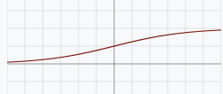

## The slides are available [here](https://github.com/valbarriere/CC5205-Mineria-Datos-Content/raw/refs/heads/main/slides_es/DM_NNet.pdf)!

---

## Perceptrón

Las **Redes Neuronales** se inspiran ligeramente en la biología de las neuronas, tratando de simular cómo la señal fluye entre capas de neuronas. El **Perceptrón** es la unidad básica que originó muchos avances en este campo.

### ¿Por qué este nombre?

En biología, una neurona:
- **Recibe** neurotransmisores por las dendritas, provenientes de sinapsis de otras neuronas.  
- **Se activa** al superar un cierto umbral de estimulación.  
- **Emite** a su vez señal eléctrica por el axón, y libera neurotransmisores en sus sinapsis.

En un **perceptrón**:
- Las entradas (análogo de dendritas) se combinan con ciertos pesos (\(w_i\)) y pasan por una función de activación que decide si hay salida (dispara) o no.
- Si supera un **umbral**, la “neurona” artificial se activa.

---

### Perceptrón: Presentación

El perceptrón más simple (con dos entradas \(x_1\) y \(x_2\)) se representa como:

1. Un **suma ponderada** \(\sum_j x_j w_j - b\)  
2. Una **función de activación** `f` que decide la salida \(y\).  

En la versión binaria más elemental:

\[
y = f\bigl(x_1 w_1 + x_2 w_2 - b\bigr) = f\bigl(W^TX- b\bigr)
\]

Donde \(f\) es (en teoría) la función **Heaviside**:

\[
f(z) = 
\begin{cases}
1, & z \ge 0\\
0, & z < 0
\end{cases}
\]

Si \(x_1 w_1 + x_2 w_2 \) supera el umbral \(b\), la salida es \(1\). 

Algunas representaciones gráficas:

, la funcion de activacion \(f\), la salida \(y\)") 

---

## Perceptrón Multicapa (MLP)

Para resolver tareas más complejas, se agregan **capas** de neuronas:

- **Capa de entrada**: Recibe las características (\(x\) o \(\mathbf{a}^{(1)}\)).
- **Capas ocultas**: Transforman la información de forma intermedia.
- **Capa de salida**: Emite la predicción final (clase, valor, etc.).

### Ejemplo de un MLP

La señal va propagándose hacia adelante, capa por capa (“feed-forward”):

---

### Ecuaciones y Composición

#### Principio de una capa

Si la capa \(\ell\) tiene \(n_\ell\) neuronas, y recibimos como entrada \(\mathbf{a}^{(\ell)}\), la salida \(\mathbf{a}^{(\ell+1)}\) se obtiene aplicando:

\[
\mathbf{a}^{(\ell+1)} 
= f\bigl( \mathbf{W}^{(\ell,\ell+1)} \; \mathbf{a}^{(\ell)} \bigr)
\]

donde \(f\) es la función de activación elemento a elemento, y \(\mathbf{W}^{(\ell,\ell+1)}\) es la matriz de pesos entre la capa \(\ell\) y la capa \(\ell+1\).

Por ejemplo, para una sola neurona \(j\) en la capa \(\ell+1\):

\[
a_j^{(\ell+1)} 
= f\Bigl(\sum_i w_{ji}^{(\ell,\ell+1)} \; a_i^{(\ell)}\Bigr)
\]

---

#### MLP: composición de capas

Un MLP con \(L\) capas puede verse como una **composición de funciones**:

\[
\mathbf{a}^{(2)} = h^{(1,2)}(\mathbf{a}^{(1)}), 
\quad
\mathbf{a}^{(3)} = h^{(2,3)}(\mathbf{a}^{(2)}) 
\quad \ldots \quad
\mathbf{a}^{(L)} = h^{(L-1,L)}(\mathbf{a}^{(L-1)}).
\]

Por tanto:

\[
\mathbf{a}^{(L)} 
= h^{(L-1,L)} \circ \cdots \circ h^{(1,2)}\;(\mathbf{a}^{(1)}).
\]

Esta \(\mathbf{a}^{(L)}\) es la **salida final** del MLP. 

Se puede escribir una funcion del MLP:

\[
MLP = h^{(L-1, L)} \circ h^{(L-2, L-1)} \circ ... \circ h^{(1,2)} \text{ \textbf{tal que} } MLP(\mathbf{a}^{(1)}) = \mathbf{a}^{(L)}
\]

> **Conclusión**: un MLP es una **función no lineal** compuesta. A mayor número de capas (profundidad), mayor **capacidad** de representar funciones complejas.

---

## Funciones de Activación

La función de activación en cada neurona **rompe la linealidad**. Sin ella, el modelo sería solo una combinación lineal de los datos. Algunas funciones típicas:

| **Nombre**                | **Gráfico**                              | **Ecuación**                                                       | **Valores en** \(\pm\infty\) | **Valores derivada en** \(\pm\infty\) |
|---------------------------|------------------------------------------|--------------------------------------------------------------------|------------------------------|----------------------------------------|
| **Heaviside** (teórica)  | [No derivable]                           | \(f(z)=\mathbf{1}_{z\ge0}\)                                        | 0,1                          | -                                      |
| **Sigmoide**              |          | \(f(z)=\frac{1}{1+e^{-z}}\)                                        | 0; 1                         | 0; 0                                   |
| **Tanh**                  |                  | \(f(z)=\frac{e^z-e^{-z}}{e^z+e^{-z}}\)                              | -1; 1                        | 0; 0                                   |
| **ReLU**                  |                  | \(f(z)=\max(0,z)\)                                                 | 0; \(z\)                     | 0; 1                                   |
| **ELU**                   |                    | \(f(z)=\begin{cases}\alpha(e^z-1)&z<0\\ z&z\ge0\end{cases}\)        | \(-\alpha\); \(z\)           | 0; 1                                   |

- **Heaviside** (original) no es derivable.  
- **Sigmoide / Tanh**: buenas para salidas en [0,1] o [-1,1], pero pueden saturarse.  
- **ReLU**: muy popular en redes profundas.  
- **ELU**: variante suavizada por debajo de 0.

---

## Recuerdos de Optimización y Entrenamiento

Para entrenar la red, definimos una **función de costo** (\(\ell\)), por ejemplo el error entre salidas reales y predichas. Queremos **minimizar** esa función respecto de los **pesos** de la red.

### Descenso del Gradiente

Si \(\theta\) representa todos los pesos:

\[
\theta \leftarrow \theta - \alpha \; \nabla_\theta \ell(\theta)
\]

donde \(\alpha\) es la **tasa de aprendizaje**.

Se pueden usar mini-batches (stochastic gradient descent - SGD) para computar gradientes parciales y hacer actualizaciones más frecuentes.

---

### Backpropagation: el núcleo del entrenamiento

**Backpropagation** (o retropropagación del error) es el algoritmo que:

1. **Calcula** la salida de la red (forward pass).  
2. **Evalúa** el error (función de costo).  
3. **Propaga** gradientes hacia atrás (desde la salida a cada capa) usando la **regla de la cadena**.  
4. **Actualiza** cada peso según su gradiente parcial.

**Explicación más detallada:**

- Tras un **forward pass**, conocemos la salida \(\mathbf{a}^{(L)}\).  
- Comparamos con la etiqueta real y obtenemos el **error** \(\ell\).  
- Para cada capa \(\ell\), la **derivada** de \(\ell\) respecto a \(\mathbf{W}^{(\ell,\ell+1)}\) se computa recursivamente, empezando por la capa de salida y yendo hacia la capa de entrada.  
- Esto es posible gracias a que 
  \[
  \frac{\partial \ell}{\partial \mathbf{W}^{(\ell,\ell+1)}} 
  = \frac{\partial \ell}{\partial \mathbf{a}^{(\ell+1)}} 
  \cdot \frac{\partial \mathbf{a}^{(\ell+1)}}{\partial \mathbf{z}^{(\ell+1)}} 
  \cdot \frac{\partial \mathbf{z}^{(\ell+1)}}{\partial \mathbf{W}^{(\ell,\ell+1)}}.
  \]
- Se multiplican derivadas (regla de la cadena) y se obtiene la dirección de ajuste de cada peso.

En la práctica, librerías como **PyTorch** o **TensorFlow** hacen esto automáticamente mediante **autograd**.

---

## Representaciones

En un MLP, cada capa oculta \(\mathbf{a}^{(\ell)}\) forma una **representación** distinta de los datos. Al componer varias capas, se construyen representaciones de nivel creciente de abstracción.

")

- En imágenes: capas iniciales detectan contornos, capas intermedias detectan partes (nariz, ojo...), capas finales reconocen objetos concretos.  
- En texto: capas iniciales identifican gramática, capas intermedias reconocen entidades, capas profundas comprenden significados complejos (sentimientos, intenciones…).

### Composicionalidad de las representaciones 

En CNN u otras redes, se pueden visualizar “filtros” que activan sobre patrones (bordes, texturas, etc.). 

### Visibilidad de filtros

Una video muy interesante de la [Deep Visualization Toolbox](https://www.youtube.com/watch?v=AgkfIQ4IGaM) para ver en tiempo real lo que activa los diferentes neuronas, las imagenes del dataset que les activan lo mas, y imagenes artificiales optimizada para activar los filtros.

La visualizacion de las imagenes que activan el mas los filtros de un AlexNet en [Distill.pub: Feature Visualization](https://distill.pub/2017/feature-visualization/): 

---

## Representation Learning for Transfer

### Aprendizaje de Representaciones

El **aprendizaje de representaciones** (Representation Learning) se basa en que la red neuronal aprende, de forma automática, **características** o **features** útiles directamente desde los datos brutos (imágenes, texto, etc.). Estas capas ocultas (o *embeddings*) pueden:

- **Generalizar** mejor que las características diseñadas a mano (hand-crafted features).  
- **Adaptarse** a distintas tareas si se transfieren.

Los intereses son varios, por ejemplo: 
* Cada capa proporciona una representación de los datos de entrada con dimensiones más bajas.
* Esas representaciones provenientes únicamente de los datos brutos a veces superan conjuntos de descriptores clásicos \(\rightarrow\) [Youtube-8M](https://arxiv.org/pdf/1609.08675): Representaciones con LogReg superaban a todos los clasificadores de vanguardia en muchas tareas.

*(Ejemplo: después de entrenar en ImageNet, las capas profundas “entienden” rasgos básicos de las imágenes. Si queremos clasificar perros vs. gatos, basta con re-entrenar poco.)*

### Transferencia

Una red entrenada en una tarea (p. ej. reconocimiento de objetos en imágenes) puede servir como base para otras tareas (p. ej. detectar nuevos tipos de objetos). Se aprovecha el **transfer learning**: 

1. Entrenamos una red (p. ej. CNN) en una gran base (ImageNet).  
2. Se “toman” sus capas iniciales como **extractor de características** (al estar entrenadas en millones de imágenes, captan contornos y patrones generales).  
3. Para una nueva tarea con pocos datos, se conectan la capa final (llamado head) nueva o se re-entrena ligeramente (fine-tuning).

De este modo, la **representación** (las activaciones intermedias) es **reutilizada**. Esto ahorra tiempo y datos:

1. El MLP o CNN grande provee features genéricas.  
2. Sólo ajustamos parcialmente la red (o las últimas capas) a la tarea específica.  

---

## Frameworks Populares

### Keras

Biblioteca de Python de alto nivel para Redes Neuronales, sobre TensorFlow u otros backends.

- [Ejemplo CNN preentrenada (VGG16)](https://blog.keras.io/building-powerful-image-classification-models-using-very-little-data.html)
- [Tutorial RNN-LSTM seq2seq](https://blog.keras.io/a-ten-minute-introduction-to-sequence-to-sequence-learning-in-keras.html)
- [Embeddings de palabras preentrenados](https://blog.keras.io/using-pre-trained-word-embeddings-in-a-keras-model.html)

### PyTorch

Biblioteca de Python centrada en el cálculo automático de gradientes y en el aprendizaje profundo.

- [Tutorial Transfer Learning con ResNet18](https://pytorch.org/tutorials/beginner/transfer_learning_tutorial.html)
- [Speech recognition con Wav2Vec2](https://pytorch.org/audio/stable/tutorials/speech_recognition_pipeline_tutorial.html)
- [RNN-GRU seq2seq para traducción](https://pytorch.org/tutorials/intermediate/seq2seq_translation_tutorial.html)

### HuggingFace Transformers

Biblioteca en Python para modelos tipo **Transformers** (BERT, GPT, etc.).

- Soporta modelos **preentrenados** en texto, visión, audio...
- Otras librerías: `Diffusers` (imágenes generativas), `Datasets`, `Accelerate`, etc.

---

# See you in the classroom!
