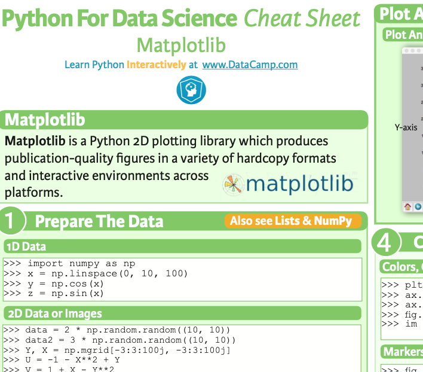
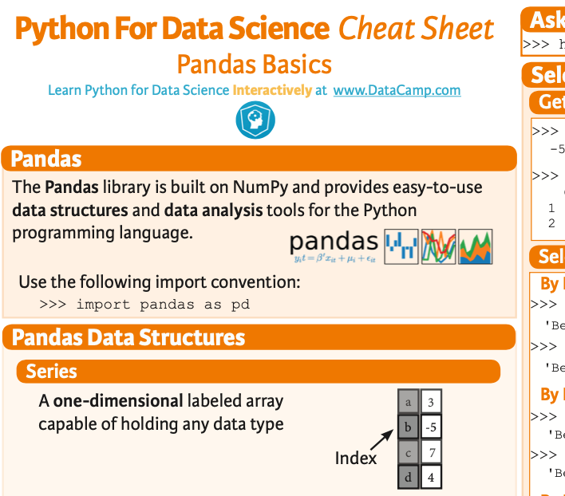
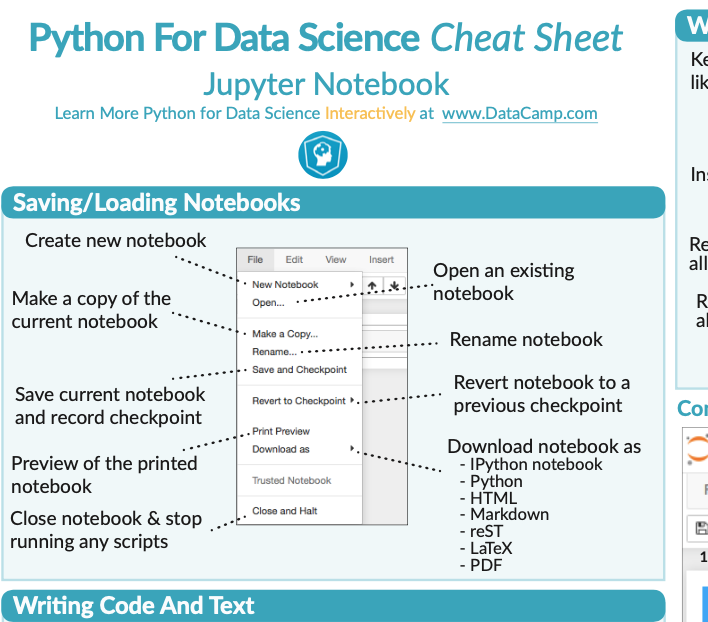
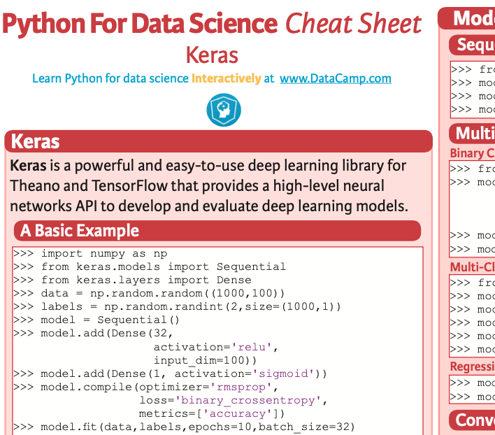
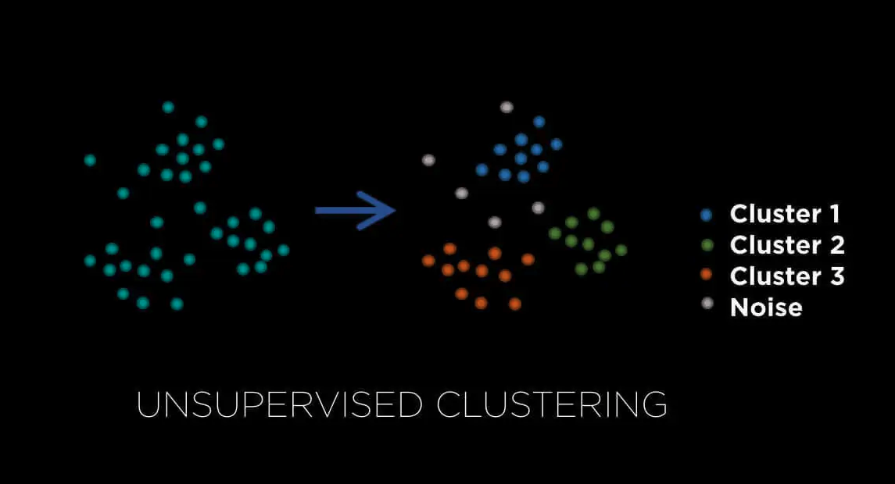

## The slides are available [here](https://github.com/valbarriere/CC5205-Mineria-Datos-Content/raw/refs/heads/main/slides_es/DM_Intro_general.pdf)!

## Introducción a la Ciencia de Datos, IA y Machine Learning

La **Minería de Datos** (o Data Mining) es un campo que busca la **extracción de conocimiento a partir de grandes cantidades de datos** mediante métodos automáticos o semiautomáticos. Se nutre de diversas disciplinas —como estadística, inteligencia artificial o informática— para **encontrar patrones** y **estructuras relevantes** en esos datos.

Sin embargo, dentro del panorama general, es útil diferenciar algunos conceptos clave:

- **Data Science (Ciencia de Datos)** se centra en el **análisis de datos** para **extraer conocimiento**.  
- **Machine Learning (Aprendizaje Automático)** utiliza **algoritmos** para **predecir** y tomar decisiones basadas en los datos.  
- **Artificial Intelligence (Inteligencia Artificial)** va un paso más allá y busca **sistemas que puedan realizar tareas “inteligentes” de manera autónoma**, a veces usando ML como herramienta fundamental.

De forma simplificada:

> - *Data mining genera entendimiento*  
> - *Machine learning genera predicciones*  
> - *Artificial intelligence genera acciones*

---

## Material Necesario

### Python y Anaconda

Para trabajar con análisis de datos y Machine Learning, se recomienda utilizar:

1. **Computadora** con Python instalado.  
2. **Anaconda** (versión con Python 3.x)  
   - Descarga desde [https://www.anaconda.com/download](https://www.anaconda.com/download)  
   - Incluye la distribución de Python y diversas bibliotecas útiles.
3. **Jupyter Notebook**  
   - Un entorno interactivo para escribir y ejecutar código Python en celdas, visualizar gráficos, explicar y anotar pasos.  
   - Permite prototipar y analizar datos de forma ordenada.
---

### Pandas

[pandas](https://pandas.pydata.org/) es una **biblioteca de Python** especializada en la **manipulación y el análisis de datos**. Ofrece estructuras de datos como:

- **DataFrame**: tablas con filas y columnas, parecidas a las hojas de cálculo.  
- **Series**: columnas o vectores unidimensionales.  

Con pandas podemos:

- **Leer** datos (csv, Excel, bases de datos SQL).  
- **Filtrar, agrupar y transformar** datos rápidamente.  
- **Crear** resúmenes estadísticos y visualizaciones sencillas.

En muchas tareas de minería de datos, `pandas` es la base para cargar y preprocesar el dataset antes de aplicar modelos de Machine Learning. 

### Cheatsheets 

Además, existen **cheatsheets** muy útiles para repasar rápidamente las funciones principales:

|             |          |             |
|-------------|----------|-------------|
|  |  |  |
|  |  |  |

Les pueden encontrar [aca](https://github.com/valbarriere/CC5205-Mineria-Datos-Content/tree/main/CheatSheets/Code). 

---

## Diferentes Métodos en Minería de Datos / Machine Learning

Hay varias tareas principales dentro del **aprendizaje a partir de datos**:

1. **Clasificación**: predecir **etiquetas** (clases discretas).  
2. **Regresión**: predecir un **valor** (continuo).  
3. **Clustering**: **agrupar** elementos según su similitud (sin etiquetas dadas).  
4. (Otros) Reducción de dimensión, detección de anomalías, etc.

### Visión general

Un diagrama popular de [Scikit-learn](https://scikit-learn.org/) muestra el **mapa** de estos métodos:

A continuación, describimos algunos ejemplos de clasificaciones, regresiones y clusterings comunes.

---

### Clasificación

La **clasificación** consiste en asignar una etiqueta a cada dato de un conjunto de posibles clases. Ejemplos:

- **Reconocimiento de emociones en el habla**: determinar si alguien está enojado, feliz, triste, etc.  
- **Clasificación de especies de animales**: a partir de características de la imagen, decidir si es un gato, un puma, etc.  
- **Detección de tumores en imágenes médicas**: clasificar entre “tumor presente” vs “sin tumor”.

---

### Regresión

La **regresión** busca predecir un valor numérico continuo. Ejemplos:

- **Reconocer la intensidad de una emoción**: ¿cuánto enojo muestra la persona?  
- **Evaluar daños tras un terremoto**: estimar la severidad de daños en una escala cuantitativa.  
- **Medir la severidad de Alzheimer** en la voz: ¿qué tan avanzada está la enfermedad?

---

### Clustering

El **clustering** (agrupamiento) agrupa automáticamente los datos según su semejanza, sin etiquetas previas. Ejemplos:

- **Topic mining** en foros políticos: descubrir de qué hablan los ciudadanos (temas más discutidos).  
- **Detección de desinformación** en redes sociales: agrupar noticias sospechosas.  
- **Segmentación de clientes**: agrupar usuarios según sus preferencias para campañas de marketing.

---

## Laboratorio: Exploración de Datos con MovieLens

Como primer enfoque, estudiaremos un **conjunto de datos de críticas de películas** (MovieLens):
- Consta de ~3 millones de puntuaciones (“ratings”).  
- Incluye **descriptores sociales**: edad, sexo, etc.  
- Permite aplicar un **análisis básico** de minería de datos.

En este lab, aprenderemos a:
- Cargar los datos en `pandas`.  
- Explorar variables (estadísticas descriptivas).  
- Cruzar información de películas y usuarios.  
- Visualizar distribuciones y relaciones simples.

---

# See you in the classroom!
