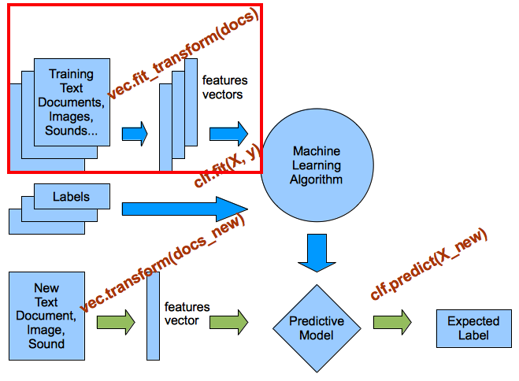
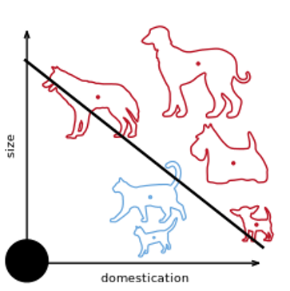
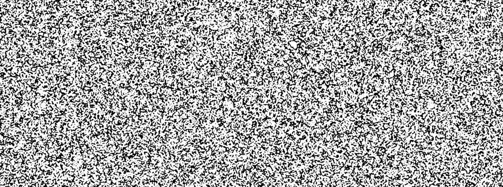
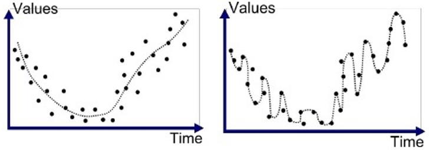
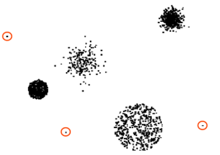
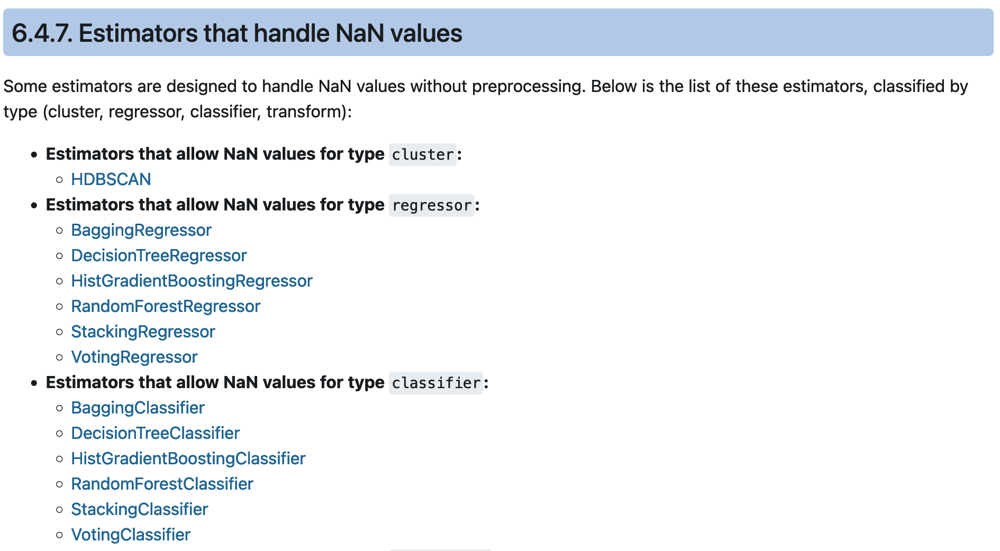
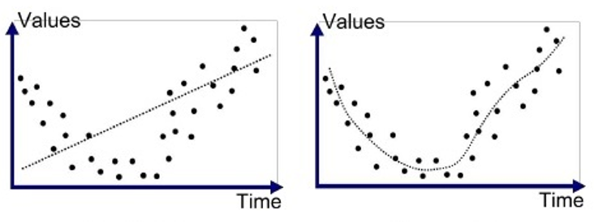
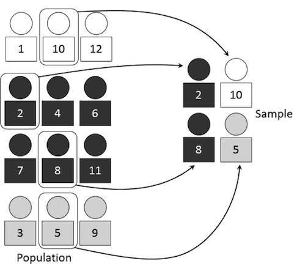
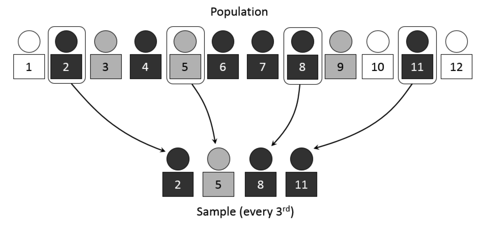
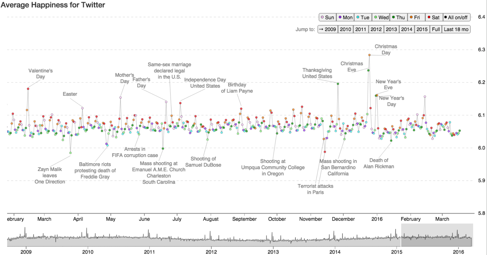

## The slides are available [here](https://github.com/valbarriere/CC5205-Mineria-Datos-Content/raw/refs/heads/main/slides_es/DM_Datos.pdf)!

Esta clase se centra en el concepto de **Datos** dentro del contexto de Machine Learning y minería de datos. Veremos de manera general cómo se representan, qué tipos de datos existen, cómo es la calidad de estos datos y finalmente cómo podemos realizar pasos de preprocesamiento para preparar los datos antes de aplicar algoritmos de aprendizaje.

---

## Generalidades

### Scikit-learn: biblioteca de ML en Python

Para manejar datos y entrenar modelos, **scikit-learn** proporciona multitud de herramientas:


- [Sitio oficial](https://scikit-learn.org)  
- [User guide](https://scikit-learn.org/stable/user_guide.html)

El **workflow general** involucra la carga de datos, preprocesamiento, extracción de características, entrenamiento y evaluación, con metodos normalizadas entre las clases:


### Patrones en los datos y vectorización

El objetivo de muchos métodos de Machine Learning es **detectar estructuras** o **patrones** en los datos. Para ello, generalmente necesitamos que la información esté en forma de **vectores** numéricos, de modo que cada ejemplo (documento, imagen, usuario, transacción, etc.) esté representado como un conjunto de variables numéricas (una por dimensión).




En la práctica, tendremos que **extraer representaciones cifradas** (features) que describan lo más relevante posible de cada ejemplo. Por ejemplo:

- Transformar un texto en un vector que represente la frecuencia de ciertas palabras.
- Medir el histograma de colores de una imagen.
- Recopilar atributos de una tabla (edad, sexo, país...) para un usuario.




### Features y etiquetas

Cuando hacemos aprendizaje **supervisado**, además de la representación vectorial (features), necesitamos una **etiqueta** o valor de salida asociado a cada ejemplo:


1. **Features**: Lo que describe al ejemplo.  
2. **Etiqueta (label)**: Variable objetivo que se quiere predecir.  
3. **Modelo**: Aprenderá parámetros para predecir la etiqueta a partir de las features.

---

## Tipos de datos

### Cualitativos vs. cuantitativos

Los datos pueden ser de tipo:

- **Cuantitativos**: numéricos, mediciones, contajes.  
- **Cualitativos**: categóricos, nominales o incluso ordinales (pero no lineales).

")

- Los datos cualitativos pueden ser más interpretables, pero a veces pierden detalle.  
- Los datos cuantitativos dan más precisión, pero pueden ser más difíciles de interpretar.

### Datos estructurados vs. no estructurados

- **Estructurados**: Se presentan en tablas con filas y columnas, es decir, cada ejemplo/instancia y sus atributos (p. ej., dataset de Titanic).  
- **No estructurados**: Texto, imágenes, audio, etc. Suelen requerir más trabajo de **vectorización**.


En muchos problemas, tendremos que convertir datos no estructurados a forma vectorial o tabular para poder aplicar algoritmos de ML.

### Distancia entre vectores

Cuando representamos datos como vectores, podemos comparar su **similitud** o **diferencia** con métricas como la distancia euclidiana o el **coseno** (similaridad de coseno):

\[
\cos(\mathbf{X}, \mathbf{X}') \;=\; 
\frac{\langle \mathbf{X}, \mathbf{X}'\rangle}{\|\mathbf{X}\|\;\|\mathbf{X}'\|}.
\]


Esto se usa en muchas aplicaciones de clustering, recomendación y clasificación.

### Extraccion con sklearn

Un ejemplo simple de one-hot encoding con scikit-learn: 

```python
>>> genders = ['female', 'male']
>>> locations = ['from Africa', 'from Asia', 'from Europe', 'from US']
>>> browsers = ['uses Chrome', 'uses Firefox', 'uses IE', 'uses Safari']
>>> enc = preprocessing.OneHotEncoder(categories=[genders, locations, browsers])
>>> # Note that for there are missing categorical values for the 2nd and 3rd
>>> # feature
>>> X = [['male', 'from US', 'uses Safari'], 
>>> ['female', 'from Europe', 'uses Firefox']]
>>> enc.fit(X)
OneHotEncoder(categories=[['female', 'male'],
                          ['from Africa', 'from Asia', 'from Europe',
                           'from US'],
                          ['uses Chrome', 'uses Firefox', 'uses IE',
                           'uses Safari']])
>>> enc.transform([['female', 'from Asia', 'uses Chrome']]).toarray()
array([[1., 0., 0., 1., 0., 0., 1., 0., 0., 0.]])
```


---

## Calidad de los datos

Los datos reales suelen estar lejos de ser perfectos. 

### Ruido

**Ruido**: irregularidad aleatoria en los datos, diferencias no explicadas por el modelo. No tienen ningún patrón. Estos errores suelen ser **inevitables e imprevisibles**. Puede provenir de:

- **Errores**: Errores de medición o muestreo que pueden distorsionar los datos.
- **Residuos**: Variación intrínseca no capturada en nuestras features. Incluso aunque no haya errores de medición, un modelo no suele capturar el 100% de la variabilidad, por lo que siempre existirán residuos.



- Es difícil (o imposible) de representar toda la realidad con un ensamble finito de observaciones
- Vamos a representar una cosa con un vector de tamaño finito, lo que puede ser reductible al fenómeno inicial, es una aproximación de la realidad 
- **Se va a quedar un componente de ruido que no se puede modelizar**

Si queremos modelizar \(Y = 3*X_1 - 2*X^2_2 + \epsilon\) con \(X_1\) y \(X_2\), no lo vamos a lograr.


### Outliers



Un **outlier** o valor atípico es un punto de datos que difiere significativamente de la mayoría. Pueden ser:

1. **Outliers ruidosos**:  
   - Son datos erróneos (fallos de medición, errores tipográficos, etc.) o extremos por variabilidad natural que no nos interesan.
   - Suelen distorsionar estimaciones estadísticas (e.g. la media).

2. **Outliers “útiles”**:  
   - Responden a eventos raros o anómalos que sí queremos detectar (fraude, crisis, rarezas de inventario).
   - Pueden ser el foco de ciertos análisis (detección de anomalías).


Para identificarlos, se pueden usar:
- Visualización (boxplots, scatter plots).
- Métodos estadísticos (rango intercuartílico, z-score).
- Algoritmos de ML (Isolation Forest, Local Outlier Factor).
- Validación de dominio (comprobar en la realidad si ese punto es auténtico o no).

 allowed to detect many of the label error in the Imagenet dataset.")


### Valores faltantes

**Missing values**: Es frecuente tener celdas vacías o desconocidas, por ejemplo:

```python
>>> from sklearn.impute import SimpleImputer
>>> imp_mean = SimpleImputer(strategy='mean')
>>> imp_mean.fit_transform([[7, 2], [4, None], [10, 5]])
```

Podemos:

- **Eliminar las filas** (si son pocas y su ausencia no afecta demasiado).
- **Imputar valores** usando la media, mediana o algoritmos como `KNNImputer`.
- **Modelos que los manejen directamente**: algunos estimadores permiten tratar valores faltantes sin preprocesamiento adicional.



---

### Duplicados

**Datos duplicados**: aparecen al combinar fuentes o por errores de recolección. Puede generar *sobrerepresentación* de ciertos ejemplos y perjudicar el entrenamiento. 

- Errores en la concatenación o carga de datos desde fuentes múltiples.
- Recolección repetida de la misma observación.

Los duplicados suelen **sobrerepresentar** determinados ejemplos, generando un sesgo en el entrenamiento. En casos masivos (p.ej., entrenamiento de grandes modelos de lenguaje), se ha demostrado que duplicar documentos puede perjudicar significativamente la calidad del modelo.

Para mitigarlos:
- **Comparar hashes o firmas** de los ejemplos (si hablamos de texto, imágenes, etc.).
- **Clustering de similitud** de ejemplos para detectar duplicaciones leves o parciales.
- **Herramientas de deduplicación** específicas (ej.: para nombres de usuarios, direcciones de correo, etc.).

Es crucial deduplicar en datasets grandes (por ejemplo, para entrenar grandes modelos de lenguaje).

En caso simple de datos tabulares, se puede utilizar metodos como `pandas.DataFrames.drop_duplicates()`.  


### Use-case: LLM 

Para entrenar un LLM desde zero, es necesario de colectar una grande cantidad de datos! Colectando datos del web, es imposible de tener datos limpios! 

- Los datos extraídos de la web tienen mucho ruido y hay que limpiarlos.
- Marcas, roturas de sintaxis, etc... todo lo que da texto no NL es perjudicial, ¡y puede impedir la convergencia!
- **Se ha determinado que la deduplicación desempeña un papel importante** en la mejora de los modelos lingüísticos ([Allamanis, 2019](https://dl.acm.org/doi/abs/10.1145/3359591.3359735?casa_token=AT3LybXtoLQAAAAA:LJLGtclf0beYhmJBuxCxUpAgDe4KspLeZYN2LWG9A3ePEl3Lkh21hsjczzjyyMiSx6dg7MQUbmtlLw); [Lee et al., 2022](https://arxiv.org/abs/2107.06499))
- Se ha demostrado que la repetición de datos es cada vez más perjudicial para la calidad del modelo a medida que aumenta el número de parámetros ([Hernandez et al., 2022](https://arxiv.org/abs/2205.10487)): 
    - para un modelo de 1B parámetros, cien duplicados son perjudiciales; 
    - a 175B, **incluso unos pocos duplicados** podrían tener un efecto desproporcionado.

---

## Limpieza y preprocesamiento

### Estandarización y normalización

Muchos algoritmos de ML (especialmente basados en distancias o gradientes) funcionan mejor cuando las **features** tienen escalas comparables.

1. **Estandarización** (StandardScaler):  
   - Convierten cada feature a media cero y varianza uno:  

     \[
     X_{\mathrm{std}} = \frac{X - \mu_X}{\sigma_X}.
     \]  

   - Afecta cada atributo de forma que su distribución resulte centrada en 0 y con desviación estándar 1.

2. **Normalización** (Normalizer):  
   - Ajusta cada **vector** para que su norma sea 1.  
   - Se suele usar en tareas donde la dirección del vector importa más que su magnitud (p.ej. coseno de similaridad).

3. **Scaling** a un rango \([0, 1]\) (MinMaxScaler):  
   - Se “comprime” cada atributo dentro de \([0..1]\):

     \[
     X_{\mathrm{scaled}} = \frac{X - X_{\min}}{X_{\max} - X_{\min}}.
     \]  

   - Útil cuando no se desea asumir forma gaussiana y se quiere mantener la escala finita.

**¿Por qué es importante?**  
- Evitar que los atributos con rangos muy grandes dominen sobre otros.  
- Favorecer la convergencia de algoritmos de optimización que basan sus pasos en gradientes (como Redes Neuronales).  
- Mejorar la calidad de métodos de distancia (k-NN, SVM, clustering) que asumen escalas comparables en las coordenadas.

Mas info [aca](https://scikit-learn.org/stable/modules/preprocessing.html#standardization-or-mean-removal-and-variance-scaling).

### Discretización

Dividir atributos continuos en bins (categorías).

La discretizacion (tambien conocida como cuantizacion o binning) permite dividir las caracterısticas continuas en valores discretos (clases). Las caracterısticas discretizadas codificadas de una sola vez pueden **hacer que un modelo sea mas expresivo, manteniendo la interpretabilidad.**


### Polynomial Features

Añadir términos polinómicos (no lineales) para incrementar la complejidad de un modelo lineal.



Mas informaciones [aca](https://scikit-learn.org/stable/modules/preprocessing.html\#generating-polynomial-features).

### Interés del sampling (muestreo)

Un mal muestreo puede generar sesgos en nuestros datos y conclusiones. Existen diversas estrategias:

- **Muestreo estratificado**: Mantiene proporciones de clases o grupos.  


- **Muestreo aleatorio simple**: Elegir instancias al azar.  
- **Muestreo sistemático**: Tomar cada k-ésimo elemento desde un punto inicial aleatorio.



### Agregaciones de datos

Combinar varios valores en uno solo (por ejemplo, la media diaria) puede:

- **Reducir ruido** y variabilidad.
- **Simplificar** el conjunto de datos.
- **Resumir** grandes volúmenes de información.



### Dimensión: *Cursa* y reducción

En altas dimensiones, los datos se dispersan y pierden significado las distancias (curse of dimensionality). Para mitigar esto:

- **Reducción de dimensión** (p. ej. PCA, selección de atributos).
- Eliminar o fusionar atributos irrelevantes.
- Acelerar el procesamiento y mejorar la interpretabilidad.


---

# See you in the classroom! 
