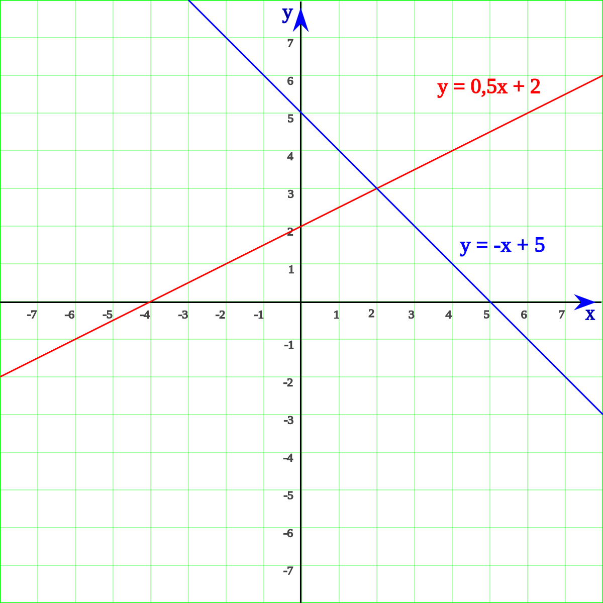
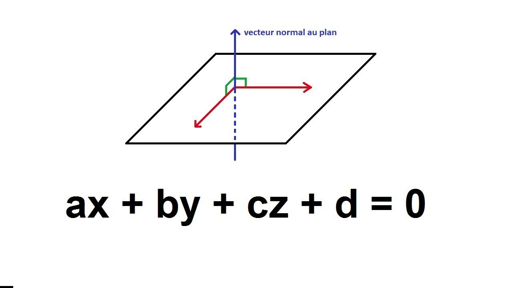
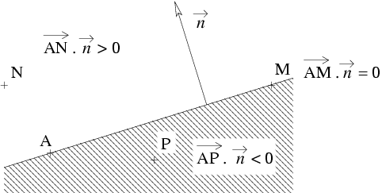
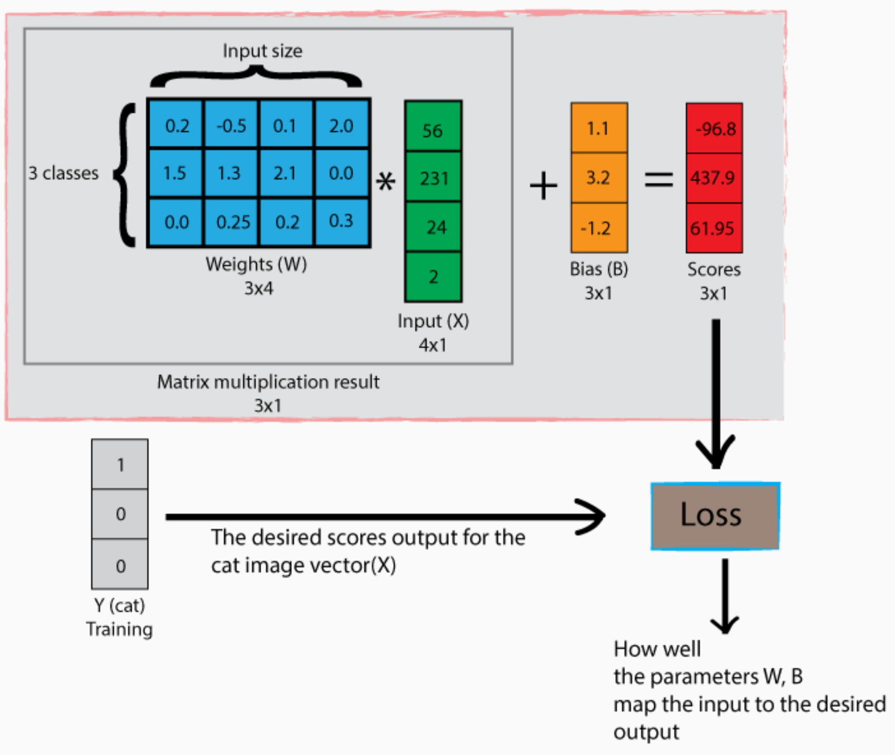
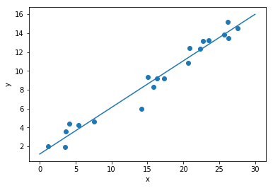
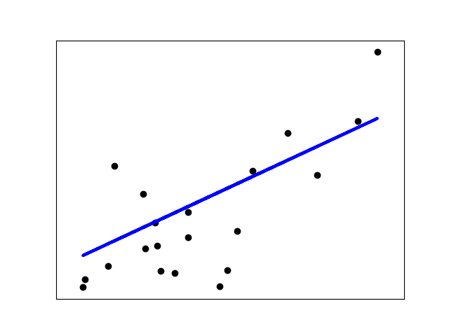
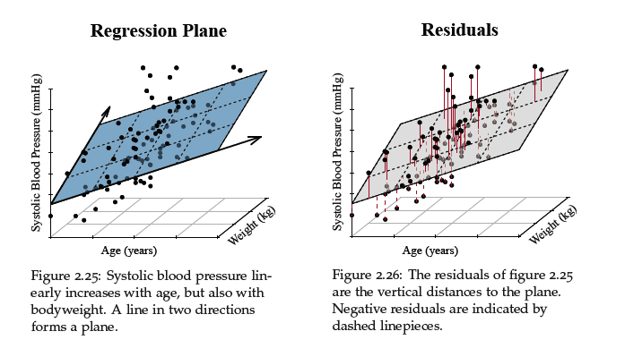
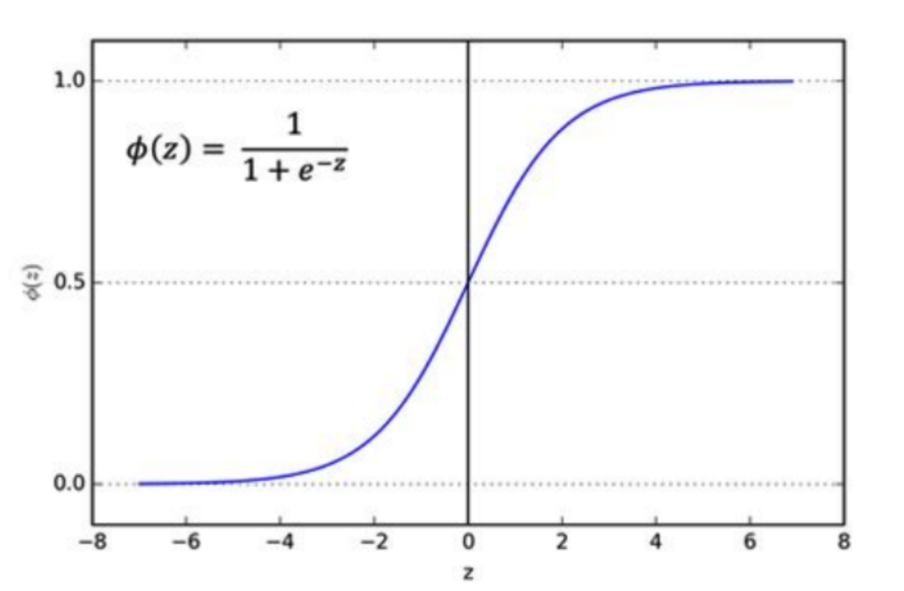

## The slides are available [here](https://github.com/valbarriere/CC5205-Mineria-Datos-Content/raw/refs/heads/main/slides_es/DM_Modelos_Lin.pdf)!

Esta clase profundiza en los **modelos de clasificación lineal**, mostrando cómo un **hiperplano** puede separar ejemplos en un espacio de características. Además, se introduce la **regresión lineal** como un caso particular de modelos lineales (cuando la variable a predecir es continua) y la regresión logística (para valores binarios o multi-clase). Finalmente, veremos una **introducción al uso de scikit-learn**, la librería de Python muy popular para Machine Learning.

*(Para el orador: Puedes enfatizar en las propiedades de la linealidad, la noción de hiperplano, la forma de pasar a modelos más complejos con un truco de aumento del espacio, y rematar con ejemplos en scikit-learn. Invita a la discusión de por qué a veces preferimos estos modelos lineales frente a otros más complejos.)*

---

## Modelos de Clasificación

### Clasificador lineal

El objetivo de un **clasificador lineal** es separar el espacio de atributos con un **hiperplano** de manera que queden los ejemplos de una clase a un lado y los de la(s) otra(s) clase(s) al otro lado.

#### Problemas lineales vs. no lineales

En la práctica, muchas fronteras de decisión no son lineales. Sin embargo, **aún podemos aplicar modelos lineales** si creamos características más elaboradas o hacemos transformaciones adecuadas.


* Una función $f : \mathcal{X}\rightarrow \mathcal{Y}$ es lineal si $f(\lambda \mathbf{x} + \mathbf{x}') = \lambda\,f(\mathbf{x}) + f(\mathbf{x}')$.
* Un caso típico es $f(\mathbf{x}) = \theta^T \mathbf{x} = \sum_i \theta_i\,x_i$.

---

#### Hiperplano (geometría)

Para $\mathbf{x} \in \mathbb{R}^d$, un **hiperplano** $\mathcal{H}$ está definido por ecuaciones tipo:
$$
w_1\,x_1 \;+\; w_2\,x_2 \;+\;\dots\;+\; w_d\,x_d \;+\; w_0 \;=\; 0.
$$

**Interpretación**: el signo de $w_1 x_1 + \dots + w_d x_d + w_0$ indica de qué lado del hiperplano se encuentra $\mathbf{x}$.



*(Para el orador: Recordar que, en 2D, se llama recta; en 3D, se llama plano; y en más dimensiones, se sigue llamando hiperplano.)*

---



En este diagrama vemos cómo la **normal** ($\vec{n}$) al hiperplano define su orientación. El término $w_0$ (o sesgo) desplaza el plano.

---

#### Producto escalar y parte afín

Si **aumentamos el espacio** añadiendo un 1 a nuestro vector de características:
$
\mathbf{x} \;=\;
\begin{pmatrix}
x_1\\
\vdots\\
x_d\\
1
\end{pmatrix},\quad
\theta \;=\;
\begin{pmatrix}
\theta_1\\
\vdots\\
\theta_d\\
\theta_0
\end{pmatrix},
$
entonces $\theta^T \mathbf{x} = w_0 + \sum_i w_i\,x_i$. Esto permite manejar en un mismo marco la parte “afín” del hiperplano.



---

#### Resumen

El **clasificador lineal** más sencillo se define como:

$$
f_{\mathbf{W}, b}(\mathbf{x}) \;=\;
\begin{cases}
+1, & \text{si } (\mathbf{W}^T\,\mathbf{x} + b)\;\ge\;0, \\
-1, & \text{en caso contrario}.
\end{cases}
$$

O, en problemas multiclase, usamos la misma idea (hiperplano para cada clase) y elegimos la que tenga la salida más alta (argmax).


*(Para el orador: Recalca cómo, si no es separable linealmente, podemos usar un truco de “features” que nos lleven a un espacio donde sí lo sea.)*

---


---

### Clasificador lineal multinomial

Para más de 2 clases, podemos tener una matriz $\mathbf{W}$, donde cada fila corresponde a un posible “hiperplano” que da una puntuación a la clase. Luego:

$$
\hat{c}(\mathbf{x})
\;=\;
\arg\max_{c}\;\bigl(\mathbf{W}_c^T\,\mathbf{x} + b_c\bigr).
$$



*(Para el orador: destacar que es una operación muy rápida, pues es un producto matriz-vector.)*

---

### Integración del sesgo

En vez de $\mathbf{W}^T\mathbf{x} + b$, se pasa a un producto escalar extendido:


---

### Aumento del espacio para no linealidad

Se puede **agregar variables no lineales** (por ejemplo $z = x^2 + y^2$) para separar datos no linealmente separables en la dimensión original. La separación sigue siendo *lineal* en el espacio de mayor dimensión.


---

## Regresión Lineal

La **Regresión Lineal** es un modelo lineal para predecir una variable continua $y$. En su forma más simple en 1D:

$$
\hat{y} \;=\; w\,x \;+\; b.
$$

O en multidimensional:

$$
\hat{y} \;=\; \mathbf{W}^T\,\mathbf{x} \;+\; b.
$$



---

### Métricas en regresión

Para estimar la calidad de la predicción:

* Error Medio Absoluto: $\frac{1}{n}\sum \bigl|Y_i - f(\mathbf{X}_i)\bigr|$
* Error Cuadrático Medio: $\frac{1}{n}\sum \bigl(Y_i - f(\mathbf{X}_i)\bigr)^2$
* Coeficiente de determinación $R^2$, que mide cuánta varianza de $Y$ explica el modelo.



*(Para el orador: Explica la interpretación de $R^2$ como fracción de varianza explicada.)*

---

### Regresión de un plano en 3D

Para dos atributos $x_1, x_2$ y una salida $y$:

$$
\hat{y} \;=\; w_1\,x_1 \;+\; w_2\,x_2 \;+\; b.
$$



---

## Regresión Logística

La **regresión logística** (en su forma binaria) se utiliza para convertir una **salida lineal** (o “distancia” en el espacio de características) en una **probabilidad** entre 0 y 1. Además, en el caso **multiclase**, se generaliza a la llamada **función softmax**, la cual asigna una probabilidad a cada clase, de modo que la suma de todas las probabilidades es igual a 1.

### Caso Binario

ara problemas de clasificación binaria, la **regresión logística** aplica la función sigmoide o *softmax* sobre la salida lineal. La idea principal es definir una **función sigmoide** que proyecte cualquier valor real (la salida lineal $\mathbf{W}^T \mathbf{x} + b$) a un rango de $]0, 1[$:

$$
\sigma(z) \;=\;
\frac{1}{1 + e^{-z}}
$$

- Cuando $z \rightarrow +\infty$, la sigmoide se acerca a 1.  
- Cuando $z \rightarrow -\infty$, la sigmoide se acerca a 0.  



En **regresión logística binaria** (dos clases), llamemos “1” a la clase positiva y “0” (o “-1”) a la negativa. Entonces la probabilidad de que un ejemplo $\mathbf{x}$ sea de la clase positiva es:

$$
P(Y = 1 \;|\; \mathbf{x})
\;=\;
\sigma\bigl(\mathbf{W}^T\mathbf{x} + b\bigr)
\;=\;
\frac{1}{1 + e^{-(\mathbf{W}^T\mathbf{x} + b)}}.
$$

Por ende, $P(Y=0 \;|\; \mathbf{x}) = 1 - P(Y=1 \;|\; \mathbf{x})$. Esto nos da una probabilidad. Para la clase final, elegimos la etiqueta según $P(Y=1) > 0.5$ (u otro umbral). En el caso binario equivale a comparar si la salida lineal es mayor o menor que 0:

- Si $\mathbf{W}^T\mathbf{x} + b > 0$, predice “1”.  
- Si $\mathbf{W}^T\mathbf{x} + b < 0$, predice “0” (o “-1”).

#### Conexión distancia-probabilidad

En modelos lineales clásicos (p.e., SVM), la salida $\mathbf{W}^T\mathbf{x} + b$ indica una **distancia** (o margen) respecto al hiperplano. Para convertir dicha cantidad en una **probabilidad**, aplicamos la función sigmoide, que comprime valores reales (infinitos en ambos extremos) a un rango de 0 a 1.

### Caso Multiclase: Softmax

Para **$C$ clases**, generalizamos la función logística a **softmax**, asignando parámetros $\theta^{(1)}, \dots, \theta^{(C)}$ (un vector por clase) y obteniendo probabilidades que suman 1:

$$
P(Y = c)
\;=\;
\frac{\exp^{<\theta^{(c)} \mid \mathbf{X}>}}
{\sum_{j=1}^{C}
\exp^{<\theta^{(j)} \mid \mathbf{X}>}}
\quad,\quad
c=1,\dots,C.
$$

donde:
- $\theta^{(c)}$ son los parámetros asociados a la clase $c$.  
- La **suma de probabilidades** sobre las $C$ clases es igual a 1 (gracias al denominador).


La clase final se predice con la regla:

$$
\hat{c}(\mathbf{X})
\;=\;
\arg\max_{1 \le c \le C} 
\,P(Y=c).
$$

Es habitual agrupar todos los vectores $\theta^{(c)}$ en una misma matriz:

$$
\theta \;=\;
\begin{pmatrix}
\vertbar & \vertbar & \cdots & \vertbar \\
\theta^{(1)} & \theta^{(2)} & \dots & \theta^{(C)} \\
\vertbar & \vertbar & \cdots & \vertbar
\end{pmatrix}.
$$

*(Cada columna es un vector de parámetros para la clase correspondiente.)*

---

## Uso de Scikit-learn

**scikit-learn** (`sklearn`) es una biblioteca de Python que nos permite entrenar y probar modelos de Machine Learning con funciones normalizadas.

### Funciones generales


En `sklearn`:

```python
from sklearn.datasets import load_iris
from sklearn.model_selection import train_test_split
from sklearn.linear_model import SGDClassifier

data = load_iris()
X, y = data.data, data.target
X_train, X_test, y_train, y_test = train_test_split(X, y, 
                        test_size=0.4, random_state=0)

clf = SGDClassifier(max_iter=1000, tol=1e-3)
clf.fit(X_train, y_train)
print(clf.score(X_test, y_test))
```

*(Para el orador: Subraya la facilidad de implementación y las funciones de utilidad para preprocesar, hacer feature extraction, validación cruzada, etc.)*

### Conjuntos de datos, extracción de características y preprocesamiento

* Múltiples datasets de juguete: Iris, Digits, Wine, etc.
* Conjuntos más grandes: RCV1 (texto), Faces (imágenes), etc.
* Módulos como `feature_extraction`, `feature_selection`, `preprocessing` para:
* Vectorizar texto
   * Seleccionar atributos relevantes
   * Normalizar los datos
   * Rellenar valores faltantes

*(Para el orador: Invita a explorar la documentación sklearn.org y mostrar un ejemplo interactivo si hay tiempo.)*

### Validación cruzada y búsqueda de hiperparámetros

Incluye herramientas como:

* `train_test_split`
* `KFold`, `StratifiedKFold` para dividir los datos
* `cross_val_score` para evaluar un modelo en K particiones
* `GridSearchCV` o `RandomizedSearchCV` para probar múltiples parámetros y hacer validación cruzada

```python
from sklearn.model_selection import GridSearchCV
parameters = {'kernel':('linear','rbf'), 'C':[1,10]}
svc = svm.SVC(gamma="scale")
clf = GridSearchCV(svc, parameters, cv=5)
clf.fit(X, y)
```

*(Para el orador: Resaltar la importancia de la validación cruzada para evitar sobreajustes y encontrar buenos hiperparámetros.)*

### Conclusión

En esta clase hemos visto:

* Cómo un clasificador lineal separa el espacio con un hiperplano.
* La regresión lineal como caso de modelo lineal para predicción de variables continuas.
* Cómo extender la linealidad introduciendo variables polinómicas o el truco del Bias.
* Un breve vistazo a la regresión logística, esencial para clasificación binaria y multi-clase con softmax.
* scikit-learn y sus funcionalidades para datasets, entrenamiento, validación y selección de hiperparámetros.

*(Para el orador: concluye enfatizando que, aunque hay modelos más complejos como redes neuronales o ensembles, entender los modelos lineales es clave para la práctica de Machine Learning y la interpretación de resultados. ¡Hasta la próxima clase!)*


# See you in the classroom!