## The slides are available [here](https://github.com/valbarriere/CC5205-Mineria-Datos-Content/raw/refs/heads/main/slides_es/DM_Modelos_SL.pdf)!

---

## K-Vecinos Más Cercanos (K-NN)

### Descripción General

K-Vecinos Más Cercanos (K-NN) es un algoritmo de aprendizaje basado en instancias que clasifica un nuevo punto según la mayoría de etiquetas entre sus K ejemplos de entrenamiento más cercanos en el espacio de características. No construye un modelo explícito.

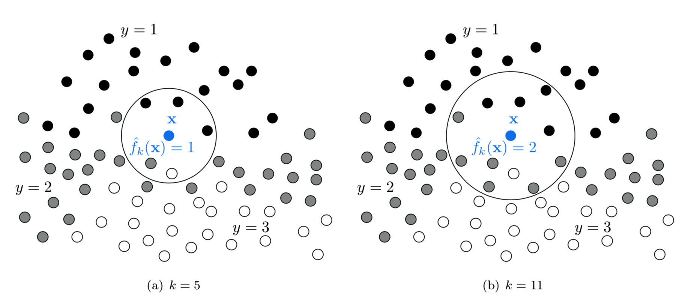

### Regla de Clasificación

Dado un punto \( \mathbf{X} \), el clasificador K-NN realiza lo siguiente:

- Sea \( S = \{(\mathbf{X}_i, y_i)\}_{i=1}^n \) el conjunto de entrenamiento
- Definir una métrica de distancia \( d(\cdot, \cdot) \)
- Ordenar los puntos de entrenamiento por distancia a \( \mathbf{X} \)
- Tomar los primeros \( K \) elementos: \( S^K_\mathbf{X} = \{\mathbf{X}_{\sigma(1)}, \dots, \mathbf{X}_{\sigma(K)}\} \)
- Contar la ocurrencia de cada etiqueta en este subconjunto

\[
h_{KNN}(\mathbf{X}) = \arg\max_y \frac{N^K_y(\mathbf{X})}{K}
\]

Donde \( N^K_y(\mathbf{X}) \) es el número de vecinos con etiqueta \( y \).

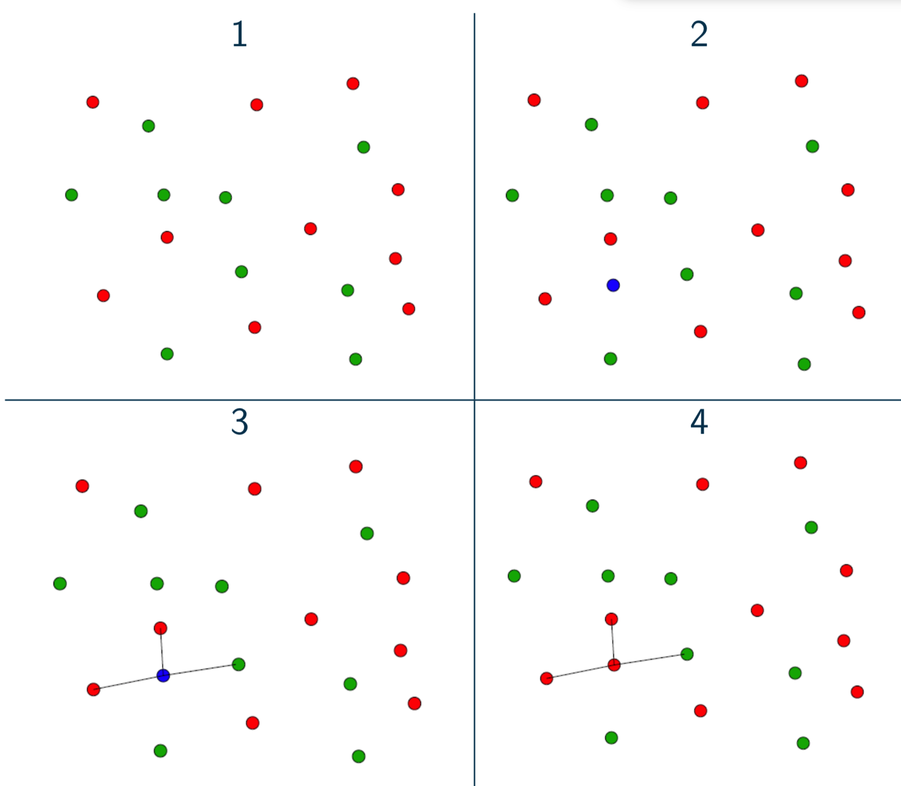

### Elección de K

El hiperparámetro \( K \) controla el equilibrio sesgo-varianza:

- **\( K \) pequeño** (ej. 1 o 3): Bajo sesgo, alta varianza; muy sensible al ruido.
- **\( K \) grande** (ej. 20+): Alto sesgo, baja varianza; suaviza la frontera de decisión.

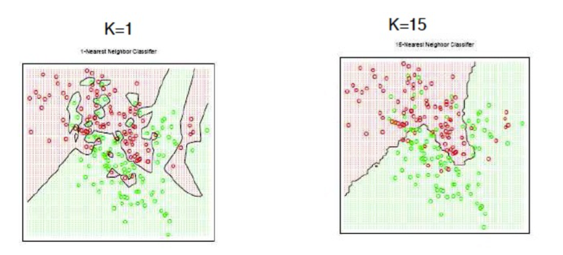

---

### Métricas de Distancia

La elección de la métrica de distancia puede afectar significativamente el rendimiento de K-NN. Métricas comunes incluyen:

\[
d(x, y) = \left( \sum_i |x_i - y_i|^p \right)^{1/p}
\]

- **Distancia Manhattan**: \( p=1 \)
- **Distancia Euclidiana**: \( p=2 \)
- **Distancia Chebyshev**: \( p = \infty \)
- **Distancia Mahalanobis**: Tiene en cuenta la covarianza de las características:
  \[
  d(x, y) = \sqrt{(x - y)^T \Sigma^{-1} (x - y)}
  \]

**Importante**: Normaliza tus características. De lo contrario, las características con rangos numéricos grandes pueden dominar el cálculo de distancia.

Más info: [Métricas de distancia en Scikit-learn](https://scikit-learn.org/stable/modules/generated/sklearn.metrics.DistanceMetric.html)

---

### Escalado y Normalización de Características

Antes de usar K-NN, aplica un preprocesamiento adecuado:

- **Estandarización**: Distribución gaussiana con media cero y varianza unitaria
  \[
  x' = \frac{x - \mu_x}{\sigma_x}
  \]

- **Escalado Min-Max**: Escalar a \([0,1]\)
  \[
  x' = \frac{x - \min(x)}{\max(x) - \min(x)}
  \]

- **Normalización L2**: Vector unitario (se usa cuando la orientación es más importante que la magnitud)

Más sobre preprocesamiento: [documentación de scikit-learn](https://scikit-learn.org/stable/modules/preprocessing.html)

---

### Fortalezas y Limitaciones

- **Ventajas**:
  - Simple e intuitivo
  - No requiere entrenamiento (aprendizaje perezoso)
  - Se adapta a fronteras no lineales

- **Limitaciones**:
  - Costoso computacionalmente en el momento de prueba
  - Afectado por la **maldición de la dimensionalidad**
  - Sensible a características irrelevantes

---

## Naive Bayes

### Regla de Bayes

El teorema de Bayes relaciona la probabilidad posterior de una clase con su probabilidad previa y su verosimilitud:

\[
P(c|o) = \frac{P(o|c) \cdot P(c)}{P(o)}
\]

Donde:

- \( P(c) \): probabilidad previa de la clase \( c \)
- \( P(o|c) \): verosimilitud de la observación dada la clase
- \( P(o) \): evidencia (puede ignorarse para clasificación)
- \( P(c|o) \): probabilidad posterior

### Suposición Naive

Naive Bayes asume que las características son **condicionalmente independientes** dada la clase:

\[
P(o|c) = \prod_{i=1}^d P(x_i | c)
\]

Por lo tanto:

\[
\hat{c} = \arg\max_c P(c) \cdot \prod_{i=1}^d P(x_i | c)
\]

Esta suposición rara vez se cumple en datos reales, pero el algoritmo a menudo funciona bien a pesar de ello.

---

### Estimación de Parámetros

Para características categóricas:

\[
P(x_i = v | c) = \frac{\text{count}(x_i = v, c)}{\text{count}(c)}
\]

#### Suavizado de Laplace

Si una palabra/característica no se observa en la clase \( c \), entonces \( P(x_i | c) = 0 \), lo que anula el producto. **El suavizado de Laplace** corrige esto:

\[
P(x_i = v | c) = \frac{\text{count}(x_i = v, c) + \alpha}{\text{count}(c) + \alpha \cdot n}
\]

- \( \alpha \): parámetro de suavizado (usualmente 1)
- \( n \): número de posibles valores de \( x_i \)

---

### Características Continuas: Naive Bayes Gaussiano

Si las características son continuas, se asume que siguen una distribución gaussiana por clase:

\[
P(x_i | y) = \frac{1}{\sqrt{2\pi \sigma^2_y}} \exp\left( -\frac{(x_i - \mu_y)^2}{2\sigma^2_y} \right)
\]

Estimar \( \mu_y \) y \( \sigma_y \) a partir de los datos de entrenamiento usando MLE.

---

### Pros y Contras

- **Pros**:
  - Entrenamiento muy rápido
  - Robusto a características irrelevantes
  - Funciona bien con datos dispersos y de alta dimensión (ej. clasificación de texto)

- **Contras**:
  - Suposición fuerte de independencia rara vez se cumple
  - Las estimaciones de probabilidad no son bien calibradas

---

## Árboles de Decisión

### Descripción General

Los Árboles de Decisión dividen el espacio de características usando hiperplanos alineados con los ejes para particionar los datos en regiones homogéneas según la etiqueta de clase.

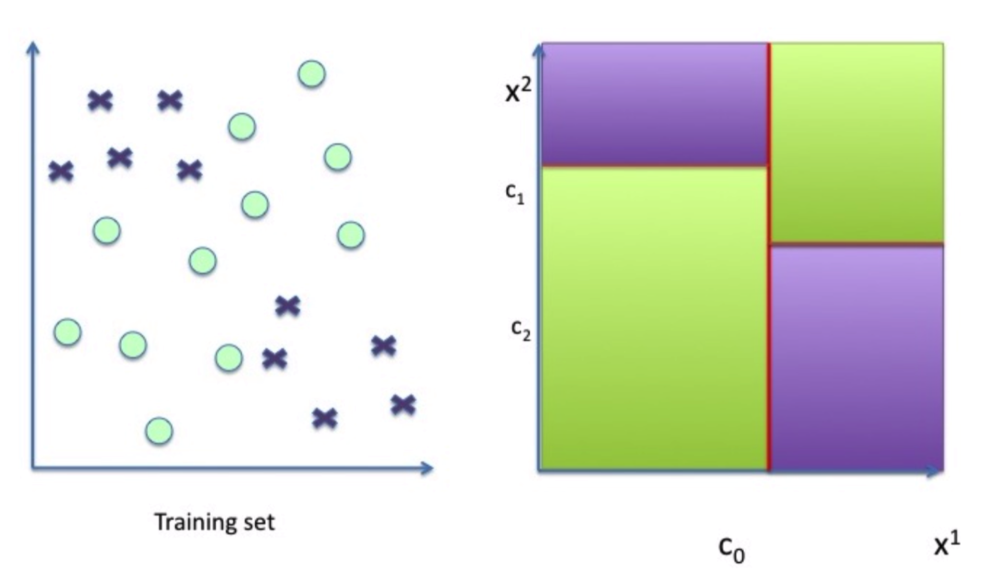

Cada nodo interno divide por una característica. Cada hoja representa una clase.

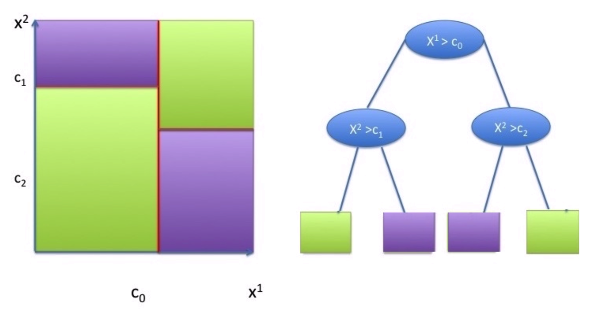

- Usan divisiones del tipo \( x^j = \tau \)
- Representan el proceso de decisión en un árbol binario
- Cada nodo corresponde a una división

\[
h_{tree}(\mathbf{X}) = \sum_{l=1}^{L} \alpha_l \mathbb{I}_{\mathcal{C}_l}(\mathbf{X})
\]

Donde cada \( \mathcal{C}_l \) es una región definida por un conjunto de divisiones, y \( \alpha_l \) es la etiqueta para esa región.

---

### Construcción del Árbol

En cada nodo, el árbol:

1. Selecciona una característica \( x^j \) y un umbral \( \tau \)
2. Divide los datos en:
   - Izquierda: \( \{x \in \mathcal{S} \mid x^j \leq \tau\} \)
   - Derecha: \( \{x \in \mathcal{S} \mid x^j > \tau\} \)

Se elige la mejor división minimizando la **impureza**.

---

### Medidas de Impureza

Dado un subconjunto \( \mathcal{S} \), se definen proporciones de clase \( p_c \). Criterios comunes:

- **Entropía**:
  \[
  H(\mathcal{S}) = -\sum_c p_c \log p_c
  \]

- **Índice Gini**:
  \[
  H(\mathcal{S}) = \sum_c p_c(1 - p_c)
  \]

- **Error de Clasificación**:
  \[
  H(\mathcal{S}) = 1 - \max_c p_c
  \]

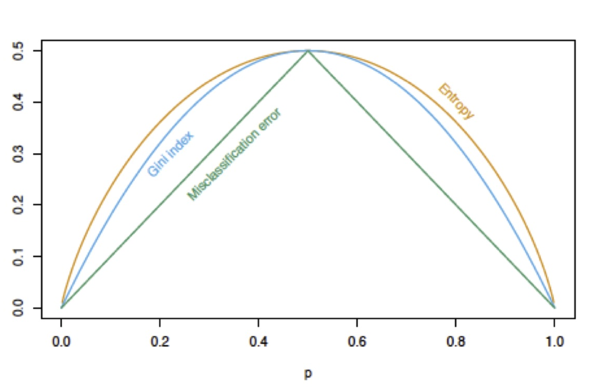

---

### Ganancia de Información

Elegir la característica \( j \) y umbral \( \tau \) que minimicen:

\[
L(t_{j,\tau}, \mathcal{S}) = \frac{|\mathcal{D}|}{n} H(\mathcal{D}) + \frac{|\mathcal{I}|}{n} H(\mathcal{I})
\]

Donde \( \mathcal{D} \) e \( \mathcal{I} \) son las divisiones izquierda y derecha.

La **Ganancia de Información** es la reducción de entropía tras la división.

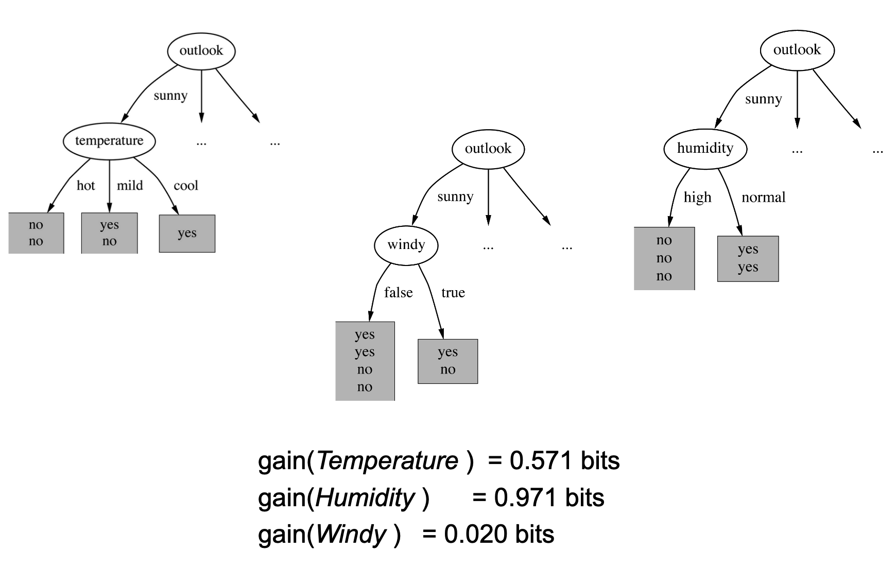

---

### Criterios de Parada

Un árbol deja de crecer cuando:

- Se alcanza la profundidad máxima
- Las hojas tienen menos de un número mínimo de muestras
- Todas las muestras en un nodo pertenecen a la misma clase

Cuidado: permitir crecimiento ilimitado lleva a sobreajuste.

---

## Métodos de Ensamble 

### Bagging (Bootstrap Aggregation)

Bagging es un método de ensamble donde:

- Se entrenan múltiples modelos en diferentes muestras bootstrap
- Sus salidas se agregan (voto mayoritario o promedio)

\[
f_{ens}(\mathbf{X}) = \frac{1}{T} \sum_{t=1}^T f_t(\mathbf{X})
\]

Reduce la **varianza**, haciendo el modelo más estable.

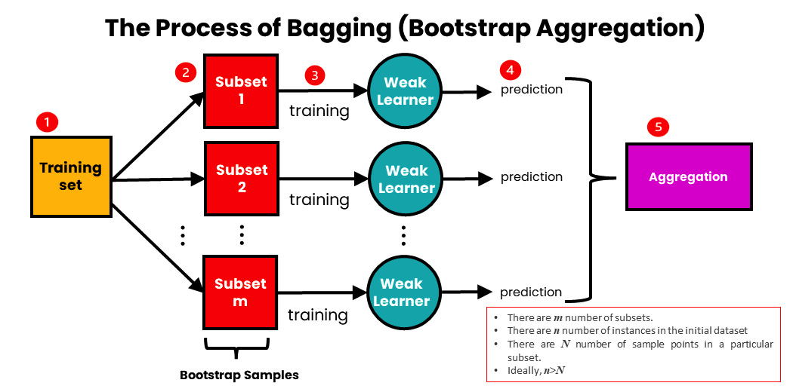

Ecuación del MSE:

\[
MSE(f_{ens}) = \frac{1}{T^2} \mathbb{E}\left[ \left( \sum_t \epsilon_t(x) \right)^2 \right]
\]

Si \( \epsilon_t \) son no correlacionados, la varianza se reduce.

---

### Boosting

Boosting entrena modelos secuencialmente, corrigiendo los errores del anterior:

1. Inicializar pesos iguales sobre los datos  
2. Entrenar modelo \( h_t \)  
3. Aumentar pesos en ejemplos **mal clasificados**  
4. Agregar predicciones con votos ponderados

Algoritmos comunes: AdaBoost, Gradient Boosting

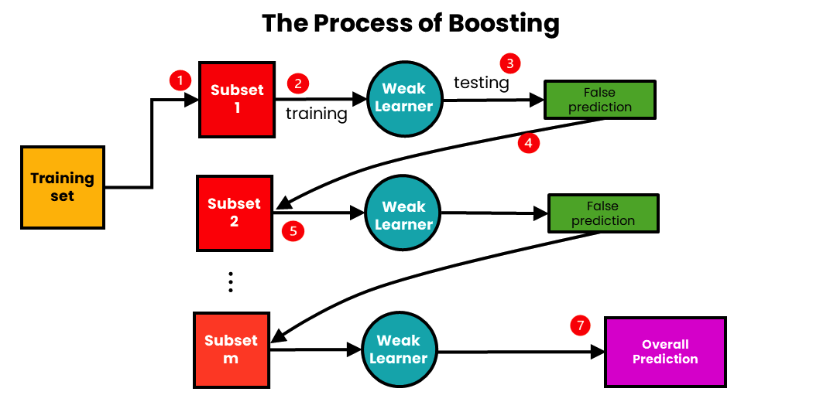

---

### Ejemplo de Boosting

Se entrenan clasificadores binarios y se agregan:

\[
F_n(x) = \text{sign}(H_{n-1}(x) + h_n(x))
\]

Cada aprendiz se enfoca más en puntos mal clasificados por el anterior.

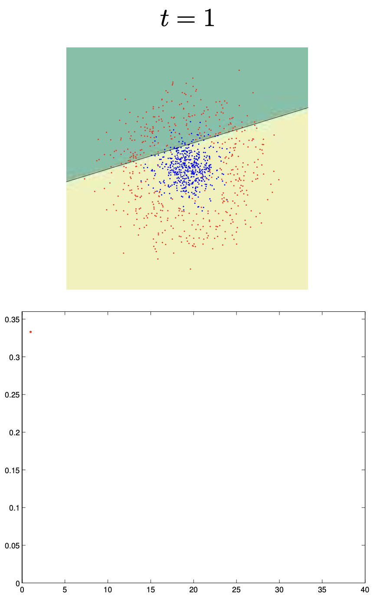

🔗 [Más sobre Boosting](https://www.analyticsvidhya.com/blog/2023/01/ensemble-learning-methods-bagging-boosting-and-stacking/)  
🔗 [Adaboost de la clase de Jiri Matas](https://www.robots.ox.ac.uk/~az/lectures/cv/adaboost_matas.pdf)

---

## Bosques Aleatorios (Random Forest)

### Motivación

Los árboles de decisión tienen **alta varianza**. Un pequeño cambio en los datos puede generar árboles muy diferentes.

**Random Forests** reducen la varianza promediando múltiples árboles entrenados en subconjuntos distintos de datos y características.

---

### Algoritmo

1. Para cada árbol \( t \in 1..T \):
   - Tomar una muestra bootstrap \( \mathcal{S}^{(t)} \)
   - Elegir aleatoriamente \( k \ll F \) características en cada nodo
   - Entrenar un árbol \( h^{(t)} \)
2. Predicción final:
   \[
   h^{(T)}(x) = \frac{1}{T} \sum_t h^{(t)}(x)
   \]

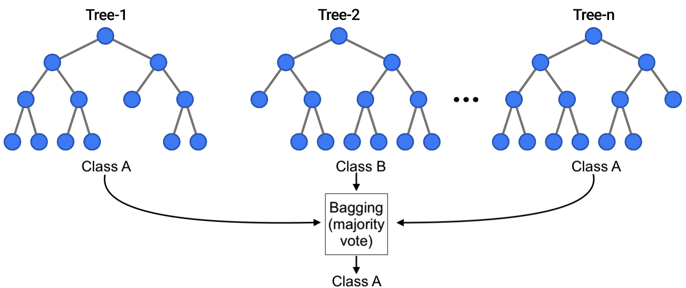

---

### Fronteras de Decisión

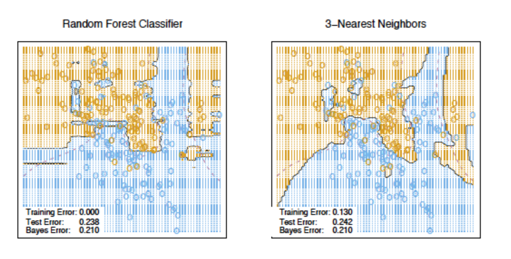

---

### Regresión con Random Forest

Para regresión, se reemplaza la impureza por reducción de varianza:

\[
L(t_{j, \tau}, \mathcal{S}) = VAR(\mathcal{S}) - \frac{|\mathcal{D}|}{n} VAR(\mathcal{D}) - \frac{|\mathcal{I}|}{n} VAR(\mathcal{I})
\]

Donde:

\[
VAR(\mathcal{S}) = \frac{1}{|\mathcal{S}|} \sum_{(x^i, y^i) \in \mathcal{S}} (y^i - \bar{y})^2
\]

---

## Tablas Resumen

### Fortalezas y Debilidades

- K-NN: Fácil de usar, pero lento y sensible a características irrelevantes  
- Naive Bayes: Rápido, funciona bien con texto  
- Árboles de Decisión: Interpretables, propensos a sobreajuste  
- Random Forests: Potentes y estables, pero menos interpretables  

🔗 [Resumen de algoritmos de SAP ML](https://cai.tools.sap/blog/machine-learning-algorithms/2/)  
🔗 [Hoja de cálculo comparativa](https://docs.google.com/spreadsheets/d/1BETYWHJwA65TjrJ-mGwQ8lSpgk3V1cq3GOYRwbm1WDU/edit?usp=sharing)

---

### Guía de Selección de Modelos

Puedes consultar el flujo de decisión de scikit-learn:

---

# See you in the classroom!

