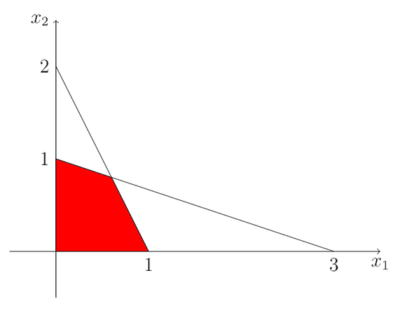
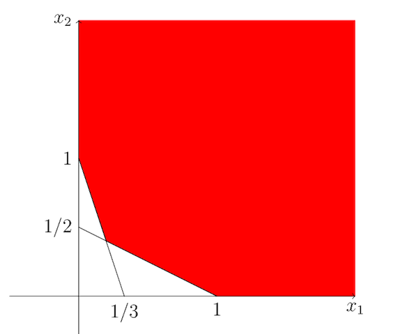

## The slides are available [here](https://github.com/valbarriere/CC5205-Mineria-Datos-Content/raw/refs/heads/main/slides_es/DM_SVM.pdf)!

## Máquinas de Vectores de Soporte (SVM)

Las **Máquinas de Vectores de Soporte** son modelos de clasificación (o regresión) que buscan encontrar un **hiperplano** o frontera de decisión que **maximice el margen** entre las clases. A continuación, veremos sus conceptos clave, la formulación lineal, el uso de kernels y, finalmente, la extensión a la regresión (SVR).

---

### Separadores de Gran Margen

El objetivo de las SVM es encontrar un **separador** (en dimensión \(d\), un hiperplano) que no solo divida correctamente las clases, sino que lo haga maximizando la distancia mínima con cualquier punto de entrenamiento.

En casos lineales y perfectamente separables, puede haber varios hiperplanos que distingan las clases. La pregunta es: **¿Cuál elegir?**

La SVM opta por el que maximiza el margen, buscando así una mejor **capacidad de generalización**.

---

### Clasificador lineal: recordatorio

Un clasificador lineal en \(\mathbb{R}^d\) se define por:

\[
f(\mathbf{X}) = \mathrm{signo}(\mathbf{W}^\top \mathbf{X} + b).
\]

En la siguiente figura se ilustra una separación lineal (en 3D) que se proyecta a una separación curva al volver al espacio 2D:

---

### SVM lineal: márgenes y restricción de separabilidad

El hiperplano \(\mathbf{W}^\top \mathbf{X} + b = 0\) y los planos paralelos \(\mathbf{W}^\top \mathbf{X} + b = \pm 1\) marcan el **margen**. Cuanto mayor sea la distancia entre esos planos, mayor será la robustez.

1. **Margen geométrico**:
   Consideremos los planos de decisión \(\mathbf{W}^\top \mathbf{X} + b = \pm 1\). La distancia entre esos dos planos es:

   \[
     \frac{2}{\|\mathbf{W}\|}.
   \]  

   Por ello, **maximizar** esa distancia es **equivalente** a **minimizar** \(\|\mathbf{W}\|\).  

2. **Forma habitual en SVM**:  
   Para comodidad numérica, se minimiza \(\tfrac{1}{2}\|\mathbf{W}\|^2\) en lugar de \(\|\mathbf{W}\|\), pero el criterio es el mismo.  

Para datos **(casi) separables**, la SVM busca:

\[
\begin{aligned}
& \min_{\mathbf{W}, b} \quad \frac{1}{2}\|\mathbf{W}\|^2 \\
& \text{sujeto a } \quad 
Y_i \, (\mathbf{W}^\top \mathbf{X}_i + b)\; \ge 1,\quad \forall i.
\end{aligned}
\]

En suma, la restricción \(Y_i(\mathbf{W}^\top \mathbf{X}_i + b)\ge 1\) asegura que cada punto esté al menos a distancia \(1/\|\mathbf{W}\|\) del hiperplano, y al reducir \(\|\mathbf{W}\|\) aumentamos este margen.

---

### Formulación primal y dual

Los problemas primal y dual son equivalentes en entornos convexos.

El problema Primal: 

\[
\begin{aligned}
&\min \quad z = c^t x, \\
&\text{subject to} \quad A x \ge b, \\
&\qquad\quad\;\; x \ge 0.
\end{aligned}
\]

El problema Dual: 

\[
\begin{aligned}
&\max \quad z = b^t y, \\
&\text{subject to} \quad A^t y \le c, \\
&\qquad\quad\;\; y \ge 0,
\end{aligned}
\]

En la práctica se implementan algoritmos para el **problema dual**, sobre todo cuando se utilizan kernels.

 

Para resolverlo, se introduce el **Lagrangiano** y se pasa a la **formulación dual**. De este modo:

- **Primal**: parámetros \(\mathbf{W}, b\).
- **Dual**: multiplicadores \(\alpha_i\).

---

### Introducción del Lagrangiano y condiciones KKT

Para resolver el problema de optimización con restricciones
\[
\min_{\mathbf{W},b} \quad \frac{1}{2}\|\mathbf{W}\|^2 
\quad\text{sujeto a}\quad Y_i(\mathbf{W}^\top\mathbf{X}_i + b)\;\ge\;1,
\]
se introduce el **Lagrangiano**:

\[
\mathcal{L}(\mathbf{W}, b, \boldsymbol{\alpha}) 
\;=\; \tfrac{1}{2}\|\mathbf{W}\|^2 
\;-\; \sum_{i=1}^n \alpha_i \,\bigl(Y_i(\mathbf{W}^\top \mathbf{X}_i + b) - 1\bigr),
\]
donde \(\alpha_i \ge 0\) son los **multiplicadores de Lagrange**.

Las **Condiciones de Karush-Kuhn-Tucker (KKT)** aplicadas a este problema especifican, entre otras, que:

- \(\nabla_{\mathbf{W}} \,\mathcal{L} = 0\) y \(\nabla_b \,\mathcal{L} = 0\) (estacionaridad).
- \(\alpha_i \ge 0\).
- \(\alpha_i \,\bigl[Y_i(\mathbf{W}^\top \mathbf{X}_i + b)-1\bigr] = 0\) (complementariedad):  
  esto implica que para cada \(i\), o bien la restricción se cumple con margen (estricto) o \(\alpha_i=0\).

---

### Resolviendo el problema Dual y aparición de \(\alpha_i\)

1. **Construcción del Dual**:  
   Se reemplaza \(\|\mathbf{W}\|^2\) y se resuelve en función de \(\boldsymbol{\alpha}\). El **problema dual** pasa a ser:
   \[
   \begin{aligned}
   &\max_{\boldsymbol{\alpha}} \quad 
     \sum_{i=1}^n \alpha_i \;-\; \tfrac{1}{2}\sum_{i,j} \alpha_i \alpha_j \,Y_i Y_j \,\langle \mathbf{X}_i,\mathbf{X}_j\rangle,\\
   &\text{sujeto a}\quad \alpha_i \ge 0,\;\; \sum_{i=1}^n \alpha_i Y_i = 0.
   \end{aligned}
   \]
2. **Solución para \(\mathbf{W}\)**:  
   De las KKT, se deduce que
   \[
     \mathbf{W} \;=\; \sum_{i=1}^n \alpha_i \,Y_i \,\mathbf{X}_i.
   \]
3. **Clasificador**:  
   \[
     f(\mathbf{X}) \;=\; \mathrm{signo}\!\Bigl(\sum_{i=1}^n \alpha_i\,Y_i\,\langle\mathbf{X}_i,\mathbf{X}\rangle + b \Bigr).
   \]

Notar que en este punto aún **no** hemos introducido el concepto de **soft margin**. Cuando todos los datos son separables y no hay ruido, cada punto cumple la restricción sin violarla. Una vez introducidos errores o ruido, pasaremos a la versión *soft margin*.
mal-dual (izq/primal, der/dual)](figures/dual.png "Un problema Dual")

---

### Vectores de Soporte

Tras la optimización, el **hiperplano** se expresa como:
\[
\mathbf{W} = \sum_{i=1}^{n} \alpha_i \, Y_i \, \mathbf{X}_i
\]
y la decisión:
\[
f(\mathbf{X}) = \mathrm{signo}\!\Big(\sum_{i=1}^{n} \alpha_i \,Y_i\;\langle \mathbf{X}_i,\mathbf{X}\rangle + b\Big).
\]

Solo los puntos con \(\alpha_i \neq 0\) se llaman **vectores de soporte**, aquellos que “soportan” el margen.

---

### Soft margin y ruido

Cuando hay ruido, el plan optimal no es necesariamente el mejor:

Cuando los datos no son perfectamente separables (o hay ruido), se permiten **variables de holgura** \(\xi_i \ge 0\). Esto penaliza los errores o los puntos dentro del margen:

\[
\begin{aligned}
& \min_{\mathbf{W},b} \quad \frac{1}{2}\|\mathbf{W}\|^2 + C \sum_{i}\xi_i \\
& \text{sujeto a} \quad Y_i(\mathbf{W}^\top \mathbf{X}_i + b) \ge 1 - \xi_i,\quad \xi_i \ge 0.
\end{aligned}
\]

El parámetro \(C\) balancea la **complejidad** vs. el **número de errores**, y es un parametro de regularizacion.

---

#### Resolución Dual con KKT

Tras introducir variables de holgura \(\xi_i \ge 0\), la **formulación primal** se convierte en:

\[
\begin{aligned}
& \min_{\mathbf{W}, b, \{\xi_i\}} \quad 
   \frac{1}{2}\|\mathbf{W}\|^2 + C\sum_{i=1}^n \xi_i, \\
& \text{sujeto a} \quad
   Y_i(\mathbf{W}^\top\mathbf{X}_i + b)\;\ge\;1 - \xi_i,\quad \xi_i \ge 0.
\end{aligned}
\]

En el **Lagrangiano**, aparecen ahora multiplicadores \(\alpha_i\) y \(\mu_i\) para manejar las restricciones asociadas a \(\xi_i\). Se obtienen condiciones KKT adicionales, incluyendo

\[
\alpha_i \,\bigl[Y_i(\mathbf{W}^\top\mathbf{X}_i + b)-1+\xi_i\bigr] \;=\; 0,\quad
\mu_i\,\xi_i \;=\; 0,\quad 
0 \;\le\;\alpha_i \;\le\; C.
\]

El problema **dual** final para la SVM con soft margin vuelve a ser:

\[
\begin{aligned}
& \max_{\boldsymbol{\alpha}} \quad 
   \sum_{i=1}^n \alpha_i \;-\; \tfrac{1}{2}\sum_{i,j} \alpha_i \alpha_j \,Y_i Y_j \,\langle \mathbf{X}_i,\mathbf{X}_j\rangle,\\
& \text{sujeto a} \quad 0 \;\le\;\alpha_i \;\le\; C,\quad \sum_{i=1}^n \alpha_i Y_i = 0.
\end{aligned}
\]

Aquí, los puntos para los que \(\alpha_i\) está en el rango \((0, C)\) se convierten en los **vectores de soporte**, y la resolución sigue análoga al caso separable.

---

#### Equivalente de regularización (Hinge loss)

Otra forma de ver la **SVM lineal** es como un caso especial de **pérdida bisagra (hinge loss)** con regularización en la norma de \(\mathbf{W}\).  
En el **espacio primal**, la minimización se puede escribir como:

\[
\underset{\mathbf{W}, b}{\min} \;\; \sum_{i=1}^{n} \max\bigl(0,\,1 - Y_i\bigl(\mathbf{W}^\top \mathbf{X}_i + b\bigr)\bigr) \;+\; \lambda \,\|\mathbf{W}\|^2,
\]

donde \(\lambda\) es un parámetro de regularización relacionado inversamente con \(C\).  

La pérdida (bisagra) \(\max(0,\,1 - Y_i(\mathbf{W}^\top \mathbf{X}_i + b))\) fuerza cada ejemplo a estar, idealmente, al menos a 1 de distancia del hiperplano, y penaliza las violaciones a ese margen. Así, minimizar la norma de \(\mathbf{W}\) y el costo bisagra conduce al mismo criterio de “gran margen” que describimos antes.

---

### Kernel Trick y espacio aumentado

La separación lineal puede no ser posible en el espacio original, pero sí en una **dimensión mayor**. Aun así, no es necesario calcular explícitamente dicha transformación \(\varphi(\mathbf{X})\). El **truco del kernel** nos dice que:

\[
k(\mathbf{X},\mathbf{X}') = \langle \varphi(\mathbf{X}), \,\varphi(\mathbf{X}') \rangle.
\]

#### Aumento del espacio (idea)

En el nuevo espacio, la separación lineal puede existir aunque en el original no:

*(Cuidado con la alta dimensionalidad si \(d\) es muy grande.)*

#### Ejemplo de Kernel Trick

Supongamos que queremos clasificar datos en \(\mathbb{R}^2\) usando un **núcleo polinomial de grado 2**. Podemos definir una transformación explícita:

\[
\varphi: (x_1,x_2) \;\mapsto\; (\,x_1^2,\;\sqrt{2}\,x_1x_2,\;x_2^2,\;\sqrt{2}\,x_1,\;\sqrt{2}\,x_2,\;1\,).
\]

Al calcular el producto punto en este espacio, se observa que: 

\[
\langle \varphi(\mathbf{X}),\varphi(\mathbf{X}')\rangle 
\;=\; \bigl(\langle \mathbf{X},\mathbf{X}'\rangle + 1\bigr)^2
\]

De modo que el **kernel** asociado es:

\[
k(\mathbf{X},\mathbf{X}') 
\;=\; \bigl( \mathbf{X}\cdot\mathbf{X}' + 1 \bigr)^2.
\]

Esto permite a la SVM trabajar implícitamente con una dimensión más alta sin calcular \(\varphi(\mathbf{X})\) ni \(\varphi(\mathbf{X}')\) de forma explícita.

---

#### Tipos de kernel comunes

- **Lineal**  
  \[
  k(\mathbf{X},\mathbf{X}') \;=\; \langle \mathbf{X},\;\mathbf{X}' \rangle
  \]

- **Polinomial**  
  \[
  k(\mathbf{X},\mathbf{X}') \;=\; \bigl(\langle \mathbf{X}, \mathbf{X}' \rangle + c\bigr)^{d}
  \]

- **Gaussiano (RBF)**  
  \[
  k(\mathbf{X},\mathbf{X}') \;=\; \exp\!\bigl(-\gamma\,\|\mathbf{X}-\mathbf{X}'\|^2\bigr)
  \]

**Lineal**  

**Polinomial**  

**Gaussiano**  

---

### Conclusión de SVM

- Se basa en **maximizar el margen** (reduce sobreajuste).  
- La solución surge de un problema de **optimización convexa** que se puede abordar en su versión dual.  
- **Los vectores de soporte** son los únicos puntos relevantes para la frontera de decisión.  
- Permite **kernels** para manejar no linealidades.  
- Ajustar hiperparámetros (ej. \(C\), grado del polinomio, \(\gamma\) en el gaussiano) puede ser costoso.

---

## Support Vector Regressor (SVR)

La SVM también puede adaptarse a **tareas de regresión**. En vez de separar puntos en clases, se busca que la predicción \(\hat{y}\) caiga en un **tubo de ancho \(\epsilon\)** en torno al valor real \(y\). A esto se lo denomina **pérdida \(\epsilon\)-insensible**.

### Principio

Si \(|\hat{y} - y| \leq \epsilon\), no se incurre en penalización. Caso contrario, se agregan variables \(\xi_i, \xi_i^*\) que miden el exceso del error respecto de \(\epsilon\).

### Formulación

- **Primal** para SVR:
  \[
  \min_{\mathbf{W},b} \;\; \tfrac{1}{2}\|\mathbf{W}\|^2 + C\sum_i (\xi_i + \xi_i^*)
  \]
  sujeto a
  \[
  \begin{cases}
  y_i - f(\mathbf{X}_i) \;\le\; \epsilon + \xi_i, \\
  f(\mathbf{X}_i) - y_i \;\le\; \epsilon + \xi_i^*, \\
  \xi_i,\xi_i^*\ge0.
  \end{cases}
  \]

- **Dual**: se obtienen multiplicadores \(\alpha_i,\alpha_i^*\) y la solución final es
  \[
  f(\mathbf{X}) \;=\; \sum_{i=1}^{n} (\alpha_i - \alpha_i^*)\,k(\mathbf{X}_i,\mathbf{X})\;+\;b.
  \]

### Ejemplo

Solo los puntos que quedan fuera del tubo (por encima de \(\epsilon\)) se convierten en vectores de soporte.

#### Resumen SVR

- Extiende la SVM a **regresión**, usando la idea de *máximo margen* alrededor de la curva aprendida.  
- El **parámetro \(\epsilon\)** controla el ancho de la zona “sin costo”; \(\xi_i,\xi_i^*\) miden el exceso.  
- **\(C\)** regula la penalización por exceder \(\epsilon\).  
- Se pueden usar **kernels** para la parte no lineal, igual que en la clasificación.

---

¡Eso es todo sobre **SVM** y **SVR**! Son métodos muy potentes y ampliamente utilizados en Machine Learning:
- **SVM** para clasificación binaria (y extensiones a multiclase).  
- **SVR** para regresión con márgenes.  
- **Kernels** para no linealidad en ambos casos.  

# See you in the classroom!
