## The slides are available [here](https://github.com/valbarriere/CC5205-Mineria-Datos-Content/raw/refs/heads/main/slides_es/DM_Clustering.pdf)!

En **aprendizaje no supervisado**, no hay una variable objetivo \(Y\) etiquetada que queramos predecir. El objetivo es **descubrir estructuras** en los datos, como **grupos (clusters)**, **patrones** o **regularidades**. Esto difiere del **aprendizaje supervisado**, donde sí conocemos las etiquetas \((\mathbf{X}_i, Y_i)\) y buscamos una función \(f\) que prediga \(Y\) a partir de \(\mathbf{X}\).

---

## Clustering: Principio

### ¿Por qué clústeres?

- **Topic modeling**: agrupar documentos o comentarios según su tema.  
- **Análisis de sentimientos**: reagrupar comentarios de usuarios para descubrir críticas comunes o elogios.  
- **Segmentación de clientes**: en marketing, agrupar clientes con comportamientos similares.  
- **Eficiencia**: entrenar submodelos especializados en cada clúster de datos.

### Ambigüedad

Distintas particiones pueden ser igualmente válidas:

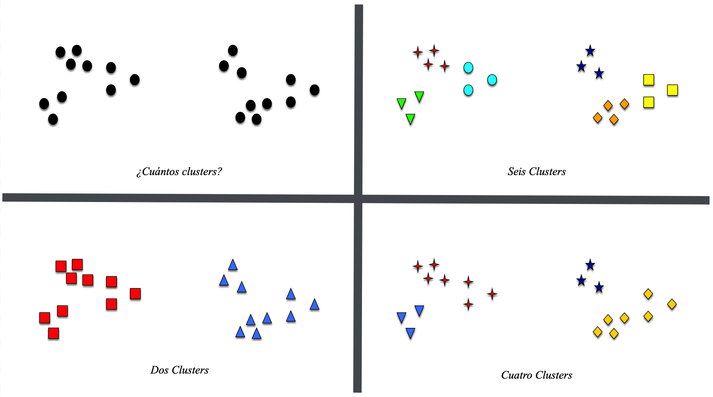

No siempre hay una sola respuesta a “cómo” agrupar.

### Objetivo intuitivo

Disminuir la **distancia intra-cluster** (los puntos de un mismo grupo están juntos) 
y aumentar la **distancia inter-cluster** (grupos lejos entre sí):

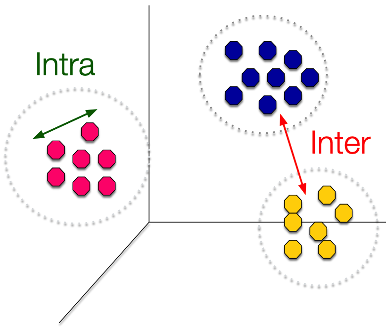

---

## K-means

### Idea general

Separar los datos en \(K\) grupos usando “centroides” (medias de cada clúster):

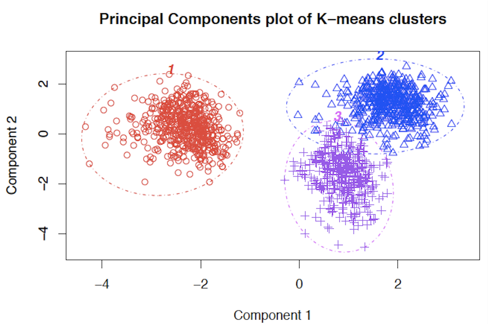

### Minimizar la SSE (Sum of Squared Errors)

K-means particiona los datos \(\mathbf{X}_i\) en \(K\) clústeres \(\{\mathcal{C}_1,\dots,\mathcal{C}_K\}\) para **minimizar**:

\[
G(\mathcal{C}_1,\dots,\mathcal{C}_K)
= \sum_{k=1}^K 
  \sum_{i\in\mathcal{C}_k} \|\mathbf{X}_i - \mu_k\|^2,
\]

donde \(\mu_k\) es el **centroide** del clúster \(k\). Cada punto se asigna al \(\mu_k\) más cercano en norma Euclídea.

### Algoritmo iterativo

1. **Asignación**: Conociendo los centroides \(\mu_k\), cada punto se asigna al más cercano.  
2. **Actualización**: Conociendo la asignación, se recalculan los centroides \(\mu_k\) 
   como la media de los puntos en cada clúster.  
3. Se repite hasta que la inercia (SSE) deje de disminuir significativamente.

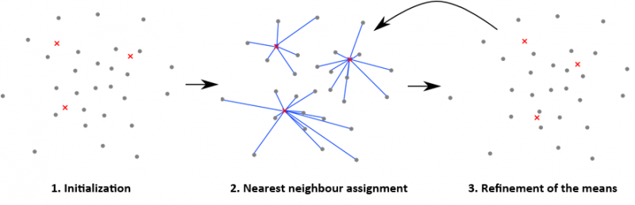

### Dependencia de la inicialización

Es un problema no convexo, por lo que su solución depende de la semilla inicial:

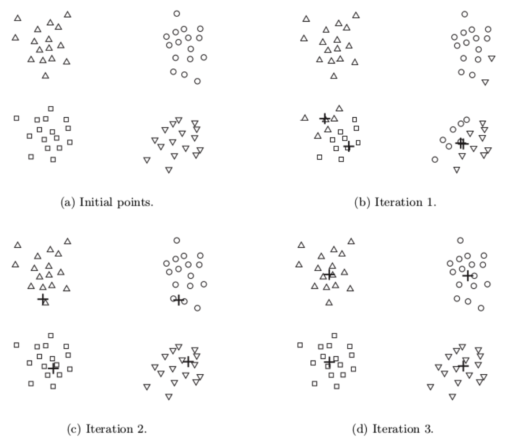
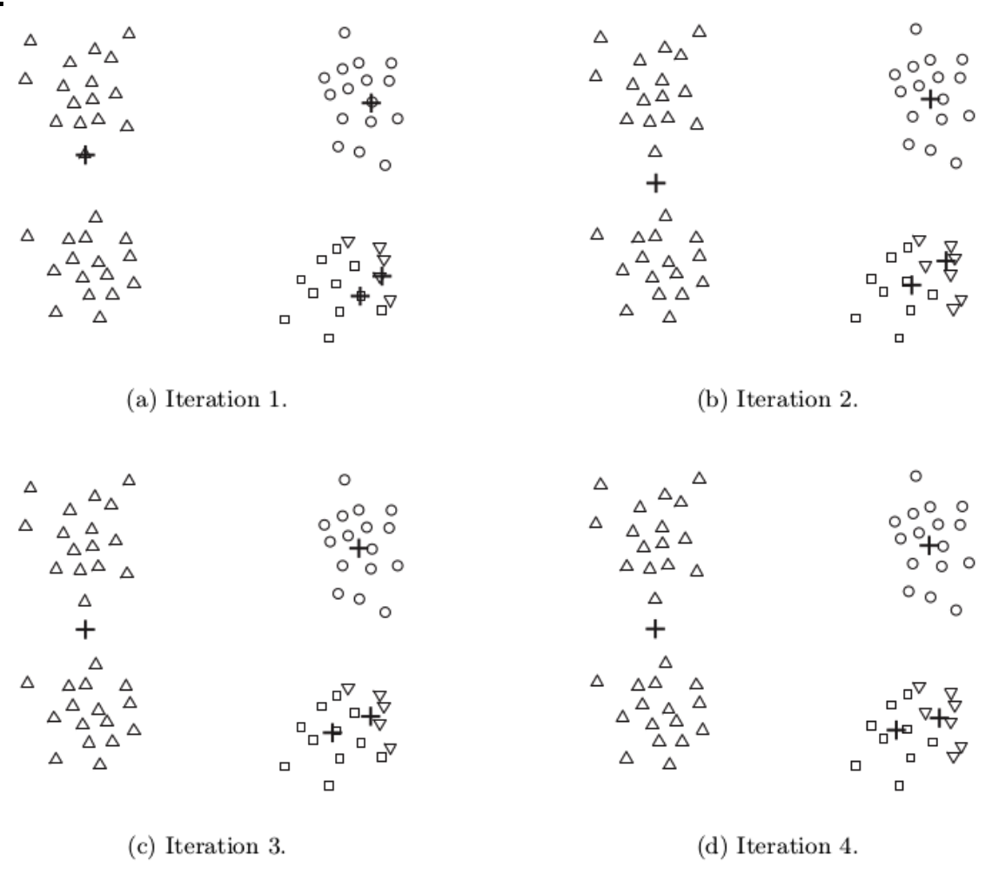

**Solución**: ejecutar K-means varias veces y elegir la partición con menor SSE.

### Elección de \(K\)

El número de clústeres debe fijarse antes. Se puede explorar varios valores y usar el 
**método del codo (elbow method)**:

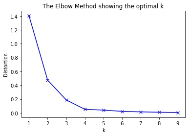

---

## DBSCAN

**DBSCAN (Density-Based Spatial Clustering of Applications with Noise)** busca regiones densas y marca los puntos dispersos como ruido.

### Ejemplo

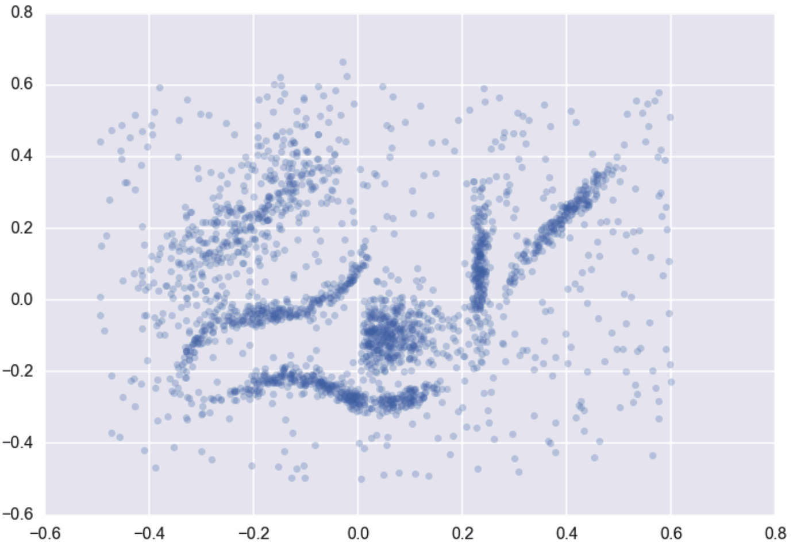

### Principios

- Parámetros:  
  - \(\texttt{eps} (\varepsilon)\): radio de vecindad.  
  - \(\texttt{min\_samples}\): mínimo de puntos para que un punto sea núcleo (core).
- Clasifica en **core**, **border**, **noise**:
  - **Core**: al menos \(\texttt{min\_samples}\) puntos en su vecindad.  
  - **Border**: no llega a ese umbral, pero está dentro del vecindario de un core.  
  - **Noise**: no pertenece a core ni al vecindario de un core.

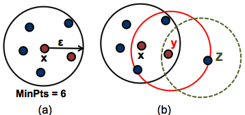

### Ventajas y Desventajas

**Ventajas**:
- Detecta formas arbitrarias (no sólo esferas).  
- Identifica outliers (ruido).  
- Menos parámetros que métodos jerárquicos.

**Desventajas**:
- Sensible a \(\texttt{eps}\) y \(\texttt{min\_samples}\).  
- Si la densidad varía drásticamente, un único \(\texttt{eps}\) no es apropiado.
- Difícil en alta dimensionalidad.

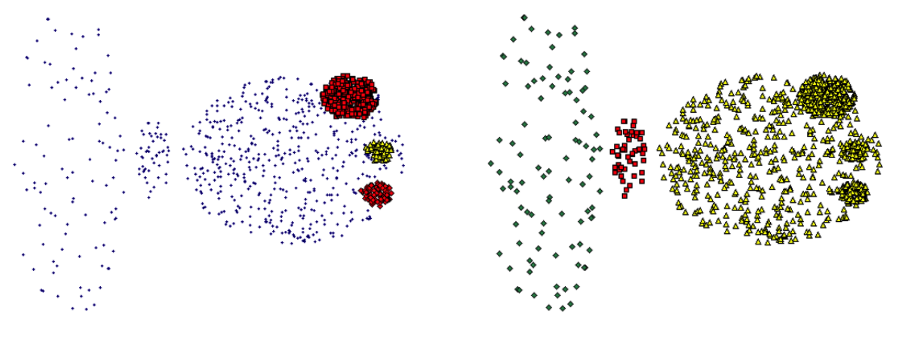

### Elección de \(\texttt{minPts}\) y \(\varepsilon\)

- **\(\texttt{minPts}\)**: regla de pulgar \(\texttt{minPts}\ge D+1\) (donde \(D\) = dimensión).  
- **\(\varepsilon\)**: usar gráfico de k-dist y buscar el “codo”.  
- <em>OPTICS</em> es una alternativa más avanzada que ajusta la densidad de forma variable.

---

## Clustering Jerárquico 

### Bisecting K-means

**Bisecting K-means**:
1. Arranca con todos los puntos como un clúster.
2. Aplica K-means con \(k=2\) (bisect) para dividirlo en 2.  
3. Escoge el clúster con mayor SSE y lo subdivide.  
4. Repite hasta lograr \(K\) clústeres.

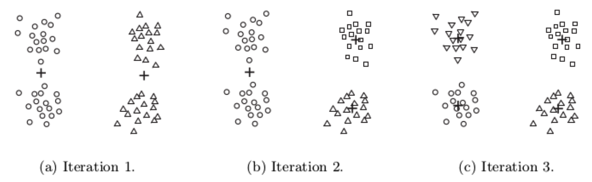

**Ventajas**: combinan jerarquía y rapidez de K-means.  
**Algoritmo**:

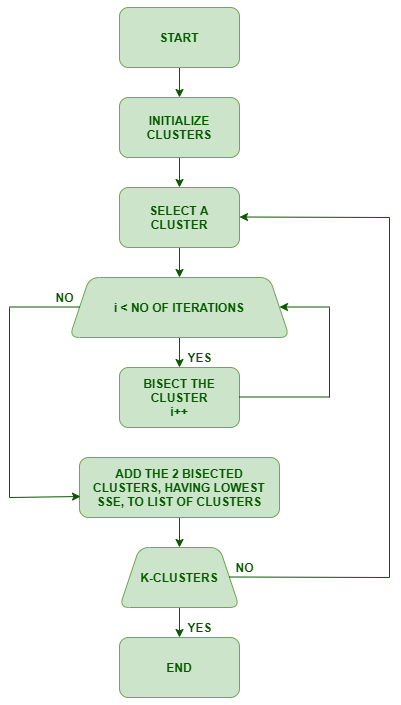

---

### Jerárquico Aglomerativo (HAC)

Otro enfoque jerárquico:

- Cada punto inicia como un clúster propio.
- Se fusionan iterativamente los 2 clústeres más cercanos.
- Se actualiza la distancia con el nuevo clúster.
- Hasta que quede un solo clúster.

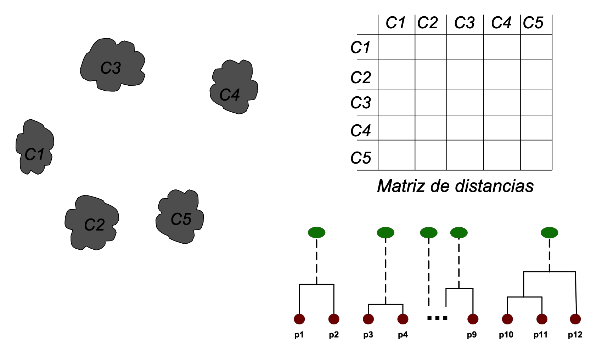

**Distancia entre clústeres (Linkage):**

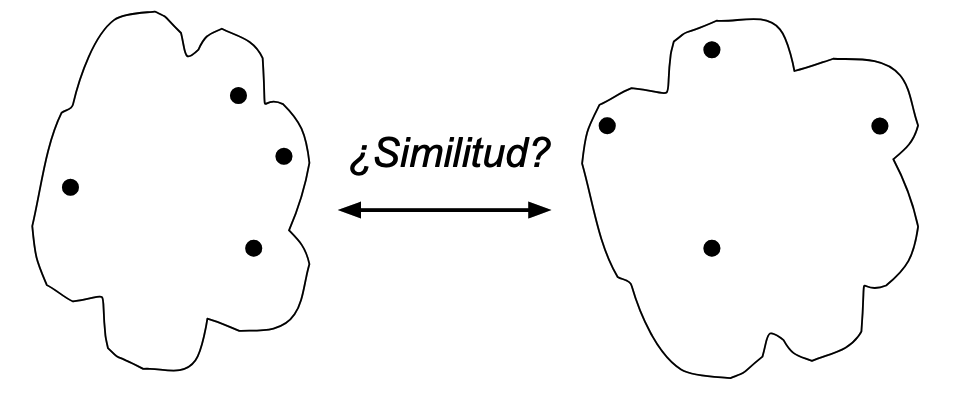

Se define la “distancia” entre dos grupos:
- **Single linkage**: menor distancia entre pares de puntos (sensibilidad al ruido).  
- **Complete linkage**: mayor distancia entre pares de puntos.  
- **Average linkage**: promedio de distancias entre pares (compromiso).  
- **Centroid** linkage: distancia entre centroides.  

---

### HDBSCAN

**HDBSCAN**: extensión jerárquica de DBSCAN
- Explora múltiples densidades.
- No fija un único \(\varepsilon\).
- Elige subconjuntos estables dentro de la jerarquía de densidad.

[Documentación HDBSCAN](https://hdbscan.readthedocs.io/en/latest)

---

## Métricas de Validación

**A diferencia del aprendizaje supervisado**, muchas veces no hay etiquetas para evaluar la calidad de un clustering. Dos enfoques:

1. **Métricas externas** (hay etiquetas reales):
   - Homogeneidad, Completeness, V-measure.
   - Rand Index, Fowlkes–Mallows.
   - Mutual Information (MI).
2. **Métricas internas** (sólo datos y clústeres):
   - **Silhouette** (valores entre -1 y 1).
   - SSE (inercia en K-means).

### Resumen rápido

- **Homogeneidad**: cada clúster contiene sólo puntos de una clase.
- **Completeness**: cada clase está contenida en un único clúster.
- **V-measure**: media armónica de las dos.
- **Fowlkes–Mallows**: ve pares de puntos coincidentes en la etiqueta y en el cluster.
- **Silhouette**: cohesión y separación sin usar clases reales.

---

## Otros métodos de clustering

Existen varias alternativas según forma de los clústeres, ruido, densidad variable, etc.

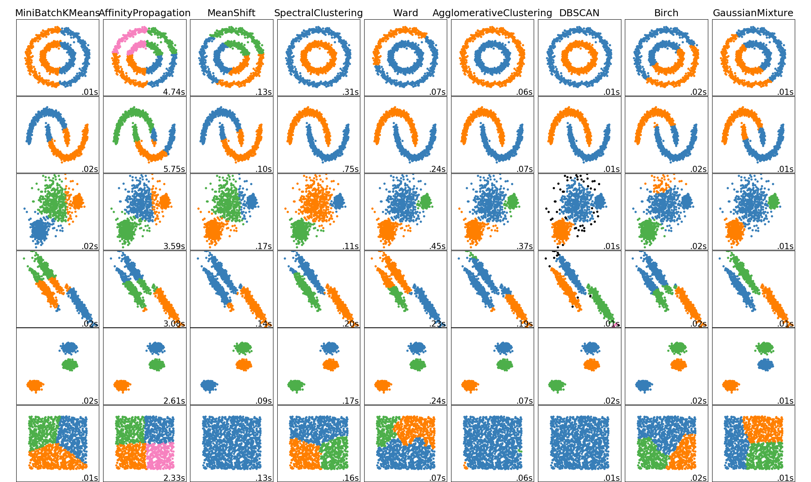

Tabla de referencia (Scikit-learn):

| Method Name                 | Parameters                                  | Scalability                                  | Use Case                                                                 | Geometry (Metric Used)                      |
|-----------------------------|---------------------------------------------|----------------------------------------------|---------------------------------------------------------------------------|---------------------------------------------|
| [**K-Means**](https://scikit-learn.org/stable/modules/clustering.html#k-means)                 | Number of clusters                          | Very large `n_samples`, medium `n_clusters` with MiniBatch code | General-purpose, even cluster size, flat geometry, not too many clusters, inductive | Distances between points                    |
| [**Affinity Propagation**](https://scikit-learn.org/stable/modules/clustering.html#affinity-propagation)    | Damping, sample preference                  | Not scalable with `n_samples`                | Many clusters, uneven cluster size, non-flat geometry, inductive          | Graph distance (e.g., nearest-neighbor graph) |
| [**Mean-Shift**](https://scikit-learn.org/stable/modules/clustering.html#mean-shift)              | Bandwidth                                   | Not scalable with `n_samples`                | Many clusters, uneven cluster size, non-flat geometry, inductive          | Distances between points                    |
| [**Spectral Clustering**](https://scikit-learn.org/stable/modules/clustering.html#spectral-clustering)     | Number of clusters                          | Medium `n_samples`, small `n_clusters`        | Few clusters, even cluster size, non-flat geometry, transductive          | Graph distance (e.g., nearest-neighbor graph) |
| [**Ward Hierarchical Clustering**](https://scikit-learn.org/stable/modules/clustering.html#hierarchical-clustering) | Number of clusters or distance threshold | Large `n_samples` and `n_clusters`           | Many clusters, possibly connectivity constraints, transductive            | Distances between points                    |
| [**Agglomerative Clustering**](https://scikit-learn.org/stable/modules/clustering.html#hierarchical-clustering) | Number of clusters or distance threshold, linkage type, distance | Large `n_samples` and `n_clusters` | Many clusters, possibly connectivity constraints, non-Euclidean distances, transductive | Any pairwise distance                       |
| [**DBSCAN**](https://scikit-learn.org/stable/modules/clustering.html#dbscan)                  | Neighborhood size                           | Very large `n_samples`, medium `n_clusters`   | Non-flat geometry, uneven cluster sizes, outlier removal, transductive    | Distances between nearest points            |
| [**HDBSCAN**](https://scikit-learn.org/stable/modules/clustering.html#hdbscan)                 | Minimum cluster membership, minimum point neighbors | Large `n_samples`, medium `n_clusters` | Non-flat geometry, uneven cluster sizes, outlier removal, transductive, hierarchical, variable cluster density | Distances between nearest points            |
| [**OPTICS**](https://scikit-learn.org/stable/modules/clustering.html#optics)                  | Minimum cluster membership                  | Very large `n_samples`, large `n_clusters`    | Non-flat geometry, uneven cluster sizes, variable cluster density, outlier removal, transductive | Distances between points                    |
| [**Gaussian Mixtures**](https://scikit-learn.org/stable/modules/clustering.html#gaussian-mixture)       | Many                                        | Not scalable                                 | Flat geometry, good for density estimation, inductive                     | Mahalanobis distances to centers            |
| [**BIRCH**](https://scikit-learn.org/stable/modules/clustering.html#birch)                   | Branching factor, threshold, optional global clusterer | Large `n_clusters` and `n_samples` | Large dataset, outlier removal, data reduction, inductive                 | Euclidean distance between points           |
| [**Bisecting K-Means**](https://scikit-learn.org/stable/modules/clustering.html#bisecting-k-means)       | Number of clusters                          | Very large `n_samples`, medium `n_clusters`   | General-purpose, even cluster size, flat geometry, no empty clusters, inductive, hierarchical | Distances between points                    |

Más info en: [clustering scikit-learn docs](https://scikit-learn.org/stable/modules/clustering.html#overview-of-clustering-methods)

---

## Use-case: BERTopic

**BERTopic** es una librería que combina embeddings (BERT) + clustering para **topic modeling** sobre textos.

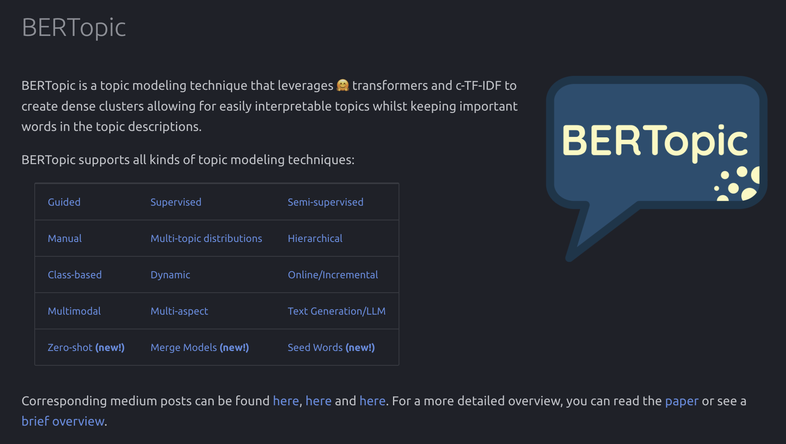

Puede:
- Agrupar oraciones/documentos en “temas” usando embeddings.
- Visualizar la **evolución** de temas en el tiempo (dynamic topic modeling).
- Hacer **clustering jerárquico** en temas descubiertos.

[BERTopic docs](https://maartengr.github.io/BERTopic/index.html)

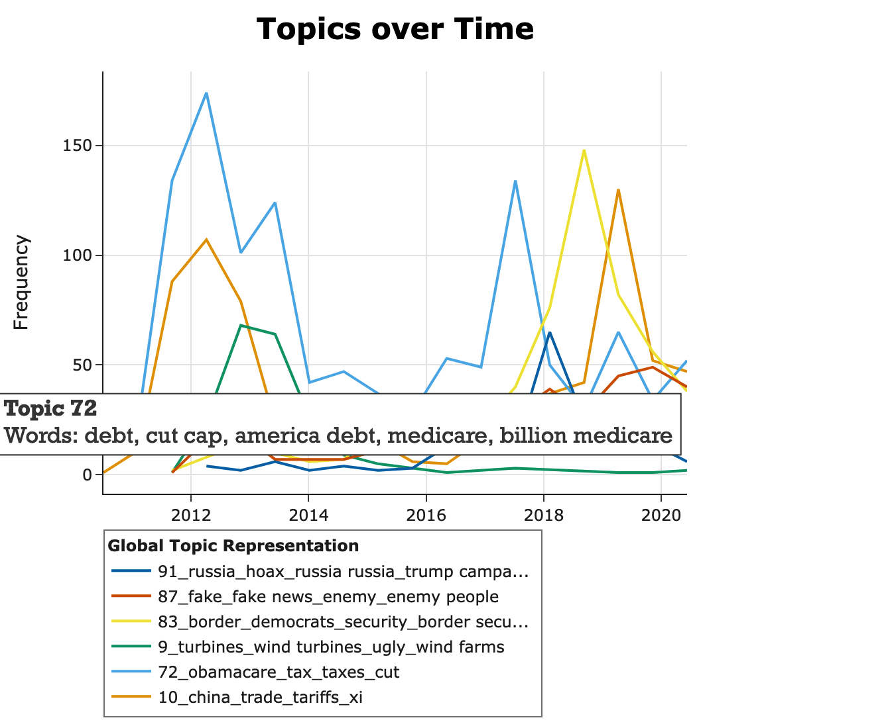

---

# See you in the classroom!

