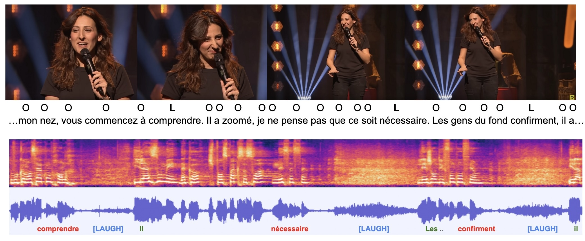

Humor Detection and Modelization in Multimodal Natural Language for Embodied Conversational Agents. 

<!--more-->

#### My role

**I am the Principal Investigator of this project**. This is a 2 years Universidad de Chile's grant from the Faculty with a total budget of 12,000,000 CLP.[^1]

### The project 

Humor is a vital aspect of human communication, enabling individuals to regulate tension, build rapport, and create a sense of inclusiveness. With the growing use of conversational agents in various fields, such as work, health, and education, there's a need to equip these systems with humorous skills to enhance user interactions.

Conversational agents have made significant progress with advancements in large language models. However, integrating multimodal behavior, including humor, remains a challenge. Humor is a complex mechanism that involves understanding semantic levels of discourse, socio-affective states, and dynamics of interactions.

The challenge lies in developing models that can understand and generate humor in various forms, including multimodal behaviors. Current conversational agents struggle to detect and produce humor effectively, leading to less fluid and less pleasant interactions.

This research project aims to develop Artificial Intelligence models that can detect and classify humorous structures in unimodal (text) and multimodal (text, speech, and non-verbal behavior) speech of individuals in monologue, and then extend these models to dialogue situations for integration into interactive systems.

To achieve this, the project involves collecting, annotating, and analyzing a corpus of stand-up videos to develop machine learning models for humor detection and classification. These models will then be extended to dialogues using a second corpus of humorous video podcasts with multiple interlocutors. Finally, the models will be evaluated through the development of interactive systems, such as conversational agents, capable of detecting humorous interventions by users.

This research falls under the fields of Artificial Intelligence, Human-Computer Interaction, Affective Computing, and Psychology, with diverse applications, including adding a humoristic intelligence module to Embodied Conversational Agents and enhancing user interactions in various domains. By developing conversational agents with humorous skills, this project aims to create more natural, engaging, and effective interactions between humans and machines.

### Papers  

Look at our first publication on the topic, [available on arviv](https://arxiv.org/abs/2505.18903).

[^1]: ~ 12k dollars