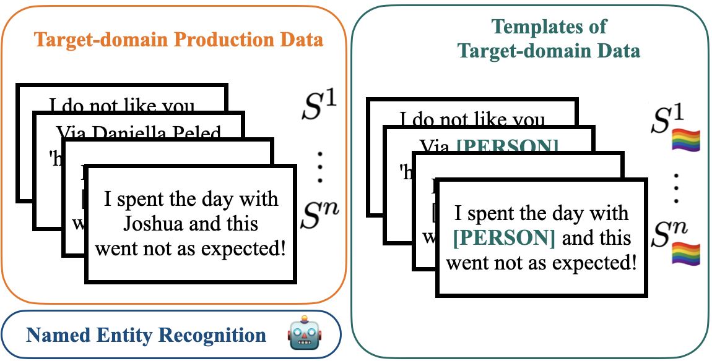

Multicultural Bias Recognition to Detect and Mitigate Racism, Xenophobia and Geographic Inequalities in Multilingual Large Language Models.

<!--more-->

#### My role

**I am the Principal Investigator of this project**. This is a 2 years [U-inicia](https://uchile.cl/convocatorias/216327/concurso-u-inicia-2024) grant from the University with a total budget of 8.000.000,00 CLP.(footnote ~ 8k dollars). 

### The project 

Classical bias detection methods used in Machine Learning and Natural Language Processing (NLP) are themselves biased because of the different confounding variables implied in the assessment of the initial biases. First they are using templates that are syntactically simple and distant from the target data on which the model will be applied. Second, current methods are assessing biases in pre-trained language models or in dataset, but not directly on the fine-tuned classifier that can actually produce harms.

We propose a simple method to detect the biases of a specific fine-tuned classifier on any type of unlabeled data. The idea is to study the classifier behavior by creating counterfactual examples directly on the target data distribution and quantify the amount of changes. We focus on named entity perturbations by applying a **Named Entity Recognition** (NER) on target-domain data and modifying them accordingly to most common names or location of a target group (gender and/or country), and this for several morphosynctactically different languages spoken in relation with the countries of the target groups. **The idea is that perturbing the input data with a non-causal change should not impact the output distribution of a model**, but it actually does with respect to the languages and the country of provenance of the added entity perturbing the sentence. An analysis of the changes helps practitioners getting a deeper understanding of how a model can react to different target groups. 

Here is an example with two sentences, $S^n$ being ambiguous and $S^1$ obvious hate speech. The model output of the perturbated versions is highly variable for the multilingual variations of *Alexander*. With some name variations, such as the Turkish or Indian, the models classify the sentences as more negative or detect less hate speech. Meaning it will not moderate the content of an insult toward this person (see below): 

We will then focus on **how to leverage LLM in order to create sentences from the target-domain data distribution**, with entites, then with more fine-grained named concepts related to the countries, such as local meals, celebrations, or regional slang.
We want first to use our method on models available in open-source that are likely to be deployed by industry, i.e., widely used classifiers for subjectivity analysis, including sentiment, emotion, hate speech, and offensive text using Twitter data. **We will assess the bias of a variety of models** such as an open-source multilingual sentiment analysis model trained over multiple-languages tweets, a multilingual stance recognition model trained over several languages and assessed over English language, an English hate speech classifier, an English large language model, and a multilingual large language model such as Llama-3.
Our work offers a fine-grained analysis of the interactions between names and languages, aiming to reveal significant biases in multilingual models, but also strong biases towards some countries’ names. **We want to link this with the pre-training data used to pre-train the LLM, by the mean of the Language Model’s (pseudo-)likelihood**. We hope to find out very socially interesting/impacting results such as a sentence containing a name from an arabic or slavic country will more likely to be tagged as negative, and less likely to be tagged as hate speech.

*In other words we want to answer the questions:* 
1. Are LLM xenophobic? 
2. How to quantify it? 
3. How to remove this bias?

### Schedule 

Milestones will follow the project objectives and milestones are defined as a group of objectives with a publication at an A(\*)-ranked conference or in a journal to complete the milestone. 

**Milestone 1** consists of objectives 1 and 2 as well as the publication of a paper at an A(\*) conference. The method developed above will be applied to different types of classifiers and generative models. A perplexity analysis will be performed to try to quantify the visible bias of the internal states of neural networks. I plan 5 months to adapt the method that already exists for LLM and use perplexity to find lassos between frequencies. 

**Milestone 2** consists of objectives 3 and 4, as well as the publication of a paper in a conference A. I plan 4 months for the artificial data generation because it is not so straightforward and we will have to work on the generation in the target distribution per se, and also on the collection and how to add in the generation the socio-cultural attributes of the different countries (2 months + 2 months). 

The last **Milestone 3** contains the final objective concerning the reduction of bias, with the aggregation of all previous results in a journal publication.  Working on bias reduction based on our method will be quite straightforward. The writing of a journal paper where we will have all the results of the project will be longer than the previous conference papers, which will have more specific and limited contents. For that I plan 4 months for the reduction and 3 months for the writing, with 2 overlapping months.  

