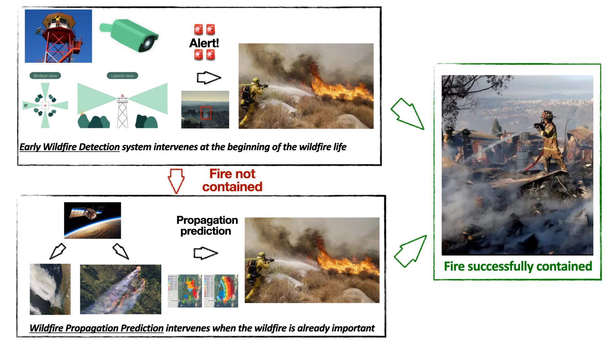

A wildfire early detection and spread prediction AI-driven decision support tool.

<!--more-->

#### My role

**I am the Director of this project**, which is a collaboration between the University of Chile, the [Centre of Artificial Intelligence](https://www.cenia.cl), the [Catholic University](https://www.puc.cl), the [National Forestry Corporation](https://www.conaf.cl), and the Non-Governmental Organization [PyroNear](https://pyronear.org/). 

This is a 2 years [*IDeA*](https://anid.cl/concursos/concurso-idea-id-2024/) project project funded to the tune of 220,000,000 CLP[^1] coming as grant from the National Research and Development Agency (ANID). 

### The project 

In Chile, there are no technologies to perform early wildfire detection based on on computer vision. Moreover there is no decision support tool to inform authorities regarding predictive propagation of ongoing wildfires. However, there are huge consequences of not containing wildfires: economical, ecological, and societal.

We propose a two-level plan to fight wildfire at different levels that are complementary. The first one to tackle the wildfire as soon as possible, the second to get information in order to distribute human, machine and water resources efficiently: 
1. Early Wildfire Prediction (EWD): Perform early wildfire detection using computer vision
2. Wildfire Spread Prediction (WSP): If the wildfire is getting out of control, an AI-based tool predict the wildfire spread using remote sensing and physics informed neural networks (PINNs). 

A global overview of both the systems and how they are interacting is visible below: 

**Step 1**: The first part consists in installing stations that detect smoke plumes in the wild. The algorithms are frugal Computer Vision methods such as small neural networks implemented on mini-computers, in order to process the information locally and send flags and data when a wildfire is detected. It is necessary to install stations on the watchtowers, collect data, annotate them, and train the models in order to achieve this. 

* Step 0.1: Gather training set: Gather smoke plume images from open-source platforms from everywhere in the world, and train a first version on the model.
* Step 0.2: Train a model: Train a first version of the EWD, using a YoloV5.
* Step 1: Putting cameras on the watchtowers. Gather data for detection and annotation purposes.
* Step 2: Process chilean images on the annotation platform. The images where potential
smoke plumes are automatically detected by the model trained on phase 0 will be manually validated by humans, in order to enhance the quality of the dataset by adapting the model to in-domain images and reducing the number of false positives.
* Step 3: Gather in-domain training set: Combine the initial training set with the annotated chilean data in order to adapt the model to the environment.
* Step 4.1: Fine-tune the smoke plume detection model images: First, the model will be trained using available data that we are collecting, then it will be fine-tuned on multimodal Chilean data
* Step 4.2: Apply the model on new images in real time
* Step 5: Visualize the alerts on a web platform: using an interface to see where the watchtower is and where the camera is looking at, but also what are the images from the camera that triggered the alert. The platform will also have an interface allowing for validation or rejection of the smoke plumes detected, in order to enhance the quality of the model.
* Step Final: Resource deployment.

**Step 2**: The second part consists in prediction of wildfire propagation using physics-informed machine learning model. It is necessary to collect a wildfire scar dataset, create a physical model of wildifre propgation based on it, to generate artificial data. On this generated data, a PINN can be trained and then fine-tuned on real chilean wildfires, and compared to reality. 

* Step 0: Gather data from various sources, like wildfire scars, meteorological data, and more. This data forms the basis for studying wildfire patterns.
* Step 1: Use of the open-source tool called Cell2Fire to simulate how wildfires spread. This helps us understand fire behavior and make predictions.
* Step 2: Creation of artificial training data using simulator. We select specific wildfires and replicate their growth using Cell2Fire. This gives us data to analyze.
* Step3:Combinationofdataandscientificmodels.Byintegratingphysics-basedequations into neural networks we build a strong model for wildfire spread. This blends real data with scientific knowledge.
* Steps 4.1/4.2: Fine-tune the model and apply it on new remote sensing data: first, the model will be trained using available data that we are collecting, then it will be fine-tuned on Chilean data.
* Step 5: Visualize on a web platform.
* Step Final: Resource deployment.

**Overall**: There is no notion of intellectual property in our project. We will base our technology on open-source knowledge like published papers that we will re-implement ourselves or by using available online code without restrictive license. Subsequently, all our models and datasets will be published as open-source resources for the research community.

### Objectives

**Main**: 
Integrated, technology-driven wildfire management system active at two levels: *(i)* to proactively detect early wildfire foci, *(ii)* accurately predict wildfire spread in order to *(iii)* facilitate real-time decision-making by allowing forest guards, firemen and policy-makers to get more information when allocating resources such as manpower, material and water or when planning evacuation

**Specific**
1. Early Wildfire Detection 
2. Wildfire Spread Prediction 
3. Decision Support Tool
4. Impact Assessment

[^1]: ~ 220k dollars

